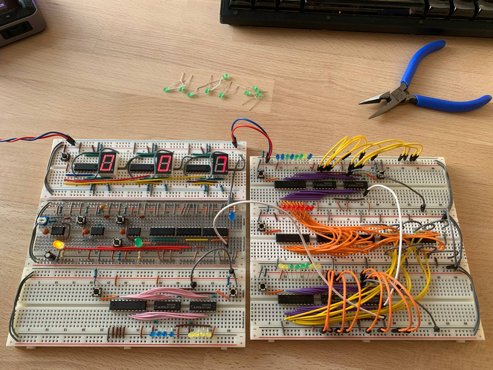

---
###
title: About Goose
###
showDate: false
showWordCount: false
showReadingTime: false
showZenMode: false
###
showLikes: false
showViews: false
###
showAuthor: true
showAuthorBottom: true
---

Hey, my name is Ilia!

I’m a microelectronics enthusiast exploring the hardware side of computing — integrated circuits, protocols, and signal behavior. For a long time I wanted to understand what really happens inside circuits, beyond abstractions and code. About a year ago, I finally decided to start. What began as simple curiosity has turned into a steady process of building, measuring, and understanding how real hardware works.

I began with basic electronics and transistor circuits, then built an 8-bit breadboard computer to see how voltage, timing, and logic connect. Lately, I’ve been experimenting with complex ICs, integrating them with Arduino boards, reading datasheets, and using the oscilloscope to make sense of what’s going on in the wires.

My approach is exploration-driven and rooted in reverse engineering. Each experiment brings a small piece of clarity about how hardware and software interact in practice.

I work at Meta on AI ASICs, but this blog is personal. It’s where I document experiments, learning progress, and the ongoing process of discovering how systems really behave underneath the surface.
