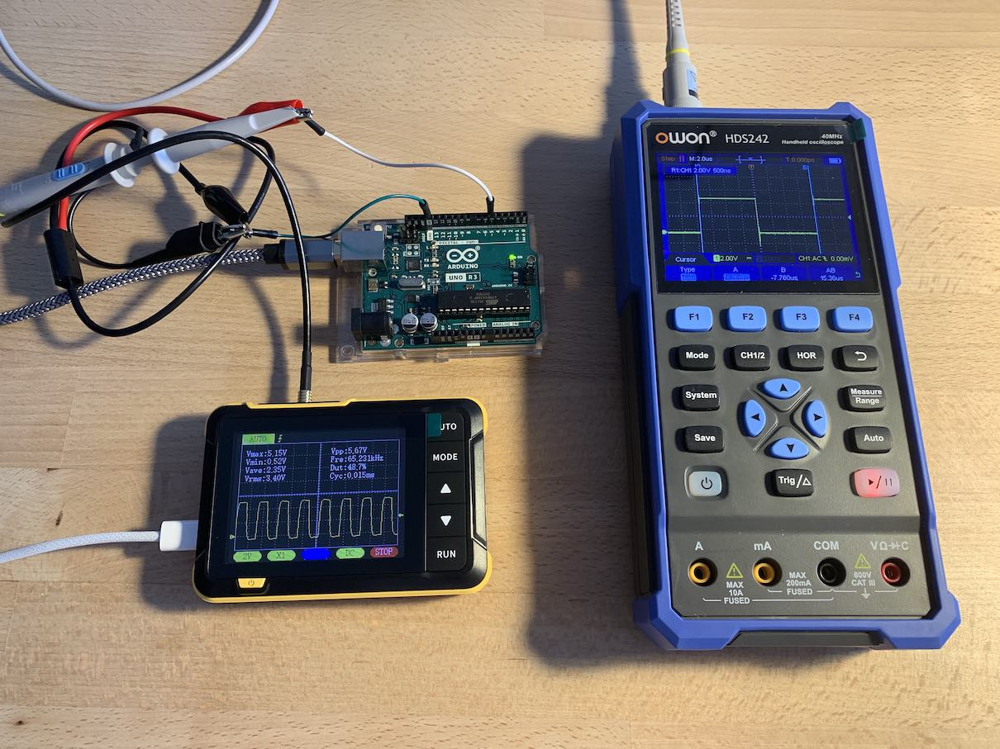
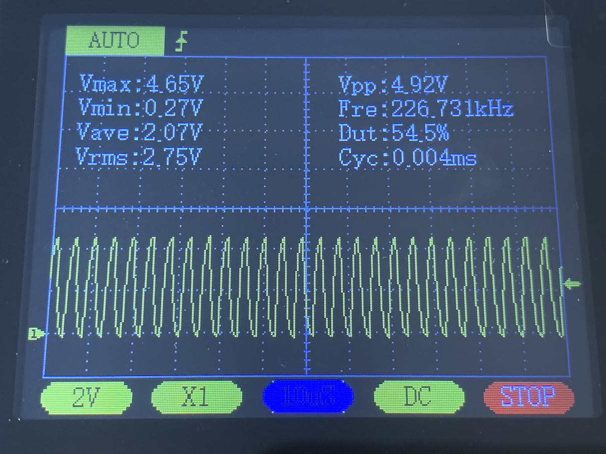

## TLDR

When I was working on improving the performance of my [EEPROM API](https://github.com/inn-goose/eeprom-api-arduino), I noticed that different microcontroller models execute read operations at different speeds, say the difference between the GIGA and the MEGA can be as much as 20x.

So I decided to measure the performance of different Arduino microcontroller models using an oscilloscope. I'm trying to determine the minimum execution time of a simple digital pin toggle operation. And try to estimate the number of CPU instructions based on the CPU clock speed and the operation’s execution time.

The source code: [sketch.ino](sketch/sketch.ino)

## CPU Clock Measurement

Connecting to `XTAL2` (pin `10`, [pinout](images/ATmega328P%20Pinout.png)) provides the CPU clock signal, as described in the [ATmega328P Datasheet](https://ww1.microchip.com/downloads/en/DeviceDoc/Atmel-7810-Automotive-Microcontrollers-ATmega328P_Datasheet.pdf) and visible on the oscilloscope screen as a stable sine wave as well.

The UNO R3 CPU frequency (16 MHz) and the OWON oscilloscope bandwidth (40 MHz) allow observing and measuring the cycle duration and board's crystal oscillator frequency with reasonable accuracy. The voltage measurement (600 mV) cannot be fully trusted, as it approaches the instrument’s measurement limit.

## `Pin Toggle` Operation Measurement

I defined the simplest operation measurable by the oscilloscope as a unit. The operation consists of two functions: one sets the pin high, the other sets it low. This sequence is looped, generating a "clean" square waveform on the oscilloscope. I refer to this operation as a `Pin Toggle` for simplicity.

(*) it can be observed that the transition from 0 to 1 takes slightly longer, with a delta within a few percent. I assume this is due to boilerplate around the `loop()` function, as the `Pin Toggle` operation also includes all the routine code hidden outside the `loop()` callback.

The fastest execution time of the `Pin Toggle` operation on the UNO R3 is approximately 10.6 µs, or 100 kHz. As my measurements below show, one operation cycle (blue) corresponds to roughly 170 CPU cycles (yellow).

## UNO R3

The most common Arduino platform. Serves as the baseline for my calculations.

| CPU Clock Frequency | CPU Cycle Length | Operation Frequency | Operation Length | Cycles per Operation |
| :--: | :--: | :--: | :--: | :--: |
| 16 MHz | 62.5 ns | 94 kHz | 10,600 ns | 170 |

$\frac{1 \text{ sec}}{\text{CPU Clock in Hz}} = \text{CPU Cycle Length in sec}$

$\frac{1 \text{ sec}}{16,000,000 \text{ Hz}} = 62.5  \text{ ns}$

### "Fast" `12` Pin

The speed and frequency of the pin toggle operation are measured. CPU frequency was measured only for the UNO R3, other platforms operate at frequencies beyond the measurement capabilities of my oscilloscopes. The measurement is performed with two oscilloscopes simultaneously to compare results.

An interesting platform feature that divides pins into "fast" and "slow". My measurements show a 1.5x regression in frequency between the "fast" `12` pin and the "slow" `5` pin.

$\frac{1 \text{ sec}}{\text{Operation Length in sec}} = \text{Operation Frequency in Hz}$

$\frac{1 \text{ sec}}{10,600 \text{ ns}} = 94 \text{ kHz}$

The frequency of the "fast" pin toggle operation is approximately 94 kHz.

**FNIRSI DSO152**: The operation frequency approaches the oscilloscope’s measurement limit, but the square wave is still clearly distinguishable, as is the voltage level.

**OWON HDS242**: A clear square waveform. This instrument is designed for such frequencies.

### "Slow" `5` Pin

The frequency of a "slow" pin toggle operation is approximately 65 kHz.

**FNIRSI DSO152**: same as the "fast" pin measurement

**OWON HDS242**: same as the "fast" pin measurement

## UNO R4

UNO R4 replaces the classic UNO with an ATmega328P, increasing the CPU clock speed, as well as the basic pin toggle operation speed. This can be useful when the microcontroller is used for data processing or data transmission. Measurements show an almost linear correlation between the CPU speed and the operation length. Both oscilloscopes handle pin toggle operation timing surprisingly well, even considering hardware limitations.

| CPU Clock Frequency | CPU Cycle Length | Operation Frequency | Operation Length | Cycles per Operation |
| :--: | :--: | :--: | :--: | :--: |
| 48 MHz | 20.8 ns | 226 kHz | 4,420 ns | 213 |

The frequency of the pin toggle operation is approximately 226 kHz. Which lays within the measurement range of the FNIRSI oscilloscope and well below the limits of the OWON model.

Connecting to pins `5` and `12` yields the same frequency value, suggesting that the distinction between "fast" and "slow" pins is specific to the UNO R3.

**FNIRSI DSO152**: The CPU clock speed is far beyond the measurement capabilities of the oscilloscope, so the instrument cannot display a clear square waveform. But it can estimate the cycle duration and fairly accurately show the voltage value vertically.

**OWON HDS242**: The oscilloscope’s bandwidth allows measuring operations at these speeds without issues, producing a clear waveform. The 40 MHz bandwidth theoretically allows measuring the CPU clock, if measure the right pin of RA4M1 CPU.

## NANO ESP32

A very fast platform with extensive wireless capabilities but few pins. My measurements show the largest CPU-cycle overhead per pin toggle. I would attribute this to the processor architecture and the compiler internals.

| CPU Clock Frequency | CPU Cycle Length | Operation Frequency | Operation Length | Cycles per Operation |
| :--: | :--: | :--: | :--: | :--: |
| 240 MHz | 4.2 ns | 726 kHz | 1,376 ns | 328 |

The frequency of the pin toggle operation is approximately 726 kHz. Which exceeds the FNIRSI measurement limit by nearly four times, but still well below the limits of the OWON model.

**FNIRSI DSO152**: Measuring the exact operation time is beyond the capabilities of the oscilloscope’s horizontal scale. However, a careful count of the pulses shows 6 operations per horizontal division, which roughly corresponds to the measurements of the higher-grade instrument.

**OWON HDS242**: Measuring the CPU frequency is not possible, as it exceeds the capabilities of the current oscilloscope. However, measuring the time of a single operation produces a very clear waveform without bounce. The NANO ESP32 operates at 3.3V, which is clearly visible on the screen. The instrument is well suited for measurements at these speeds.

## GIGA R1

The fastest platform, which also allows connecting many pins and performing logic analysis of complex circuits. Only the OWON oscilloscope was capable of measuring the pin toggle operation time. CPU clock measurements are beyond the capabilities of both instruments.

| CPU Clock Frequency | CPU Cycle Length | Operation Frequency | Operation Length | Cycles per Operation |
| :--: | :--: | :--: | :--: | :--: |
| 480 MHz | 2.1 ns | 2.15 MHz | 466 ns | 222 |

The frequency of the pin toggle operation is approximately 2.15 MHz. Making the FNIRSI oscilloscope unusable and creating some challenges for the OWON model.

**FNIRSI DSO152**: Measuring the exact operation time is beyond the capabilities of the oscilloscope’s horizontal scale. An approximate count gives 3 operations per 10 µs scale, which differs from the actual value by a factor of 7.

**OWON HDS242**: Measuring the execution time of a single operation approaches the limit of the horizontal display, but shows the reasonable waveform. The voltage difference is less than 5 volts due to signal bounce.

## Conclusion

The ratio between the execution time of the pin toggle operation and the CPU clock speed depends on the hardware and compilers but remains fairly predictable. Several repeated measurements were made to confirm data consistency.

| Microcontroller | CPU Clock Frequency (MHz) | Operation Frequency (kHz) | Operation Length (ns) | Cycles per Operation |
| -- | :--: | :--: | :--: | :--: |
| Arduino UNO R3 | 16 | 94 | 10,600 | 170 |
| Arduino UNO R4 | 48 | 226 | 4,420 | 213 |
| Arduino NANO ESP32 | 240 | 726 | 1,376 | 328 |
| Arduino GIGA R3 | 480 | 2,150 | 466 | 222 |

The most cycles are required on the ESP32 platform, and the fewest on the ATmega328P. However the CPU clock directly affects the operation speed despite instruction overhead: the higher the processor speed, the faster the commands execute.

This is confirmed by measurements of the 28C64 EEPROM read operation. On the slowest MEGA with an ATmega328P, reading the entire memory takes approximately 1.4 sec, whereas on the GIGA with an STM32H7 it takes only 38 ms.