## TLDR

When I started working on my first digital audio project, I quickly learned that audio circuits use not only a positive supply rail, but also a negative rail. I had not encountered negative rails before, so it was necessary to study the topic in more detail.

In this post, I have collected several approaches to building a positive/negative power supply. Since this project is focused on digital audio, a 5 V power supply is used. Older integrated circuits may operate from 12 V supplies, but that area is intentionally left outside the scope of this work.

The simplest solution would be to use two wall warts, as this approach requires neither laboratory power supplies nor additional voltage regulators, although it can be somewhat bulky. But my preferred solution uses a single L7805 voltage regulator together with an adjustable PSU, as this setup occupies minimal board space. Two voltage regulators can also be used if a 12 V (or higher) PSU is available.

## Two 5V Wall Warts

This is a fairly common recommendation on Reddit: use two wall warts, tie the positive output of one to the negative output of the other, and treat that connection as ground. The remaining two outputs then provide +5 V and −5 V.

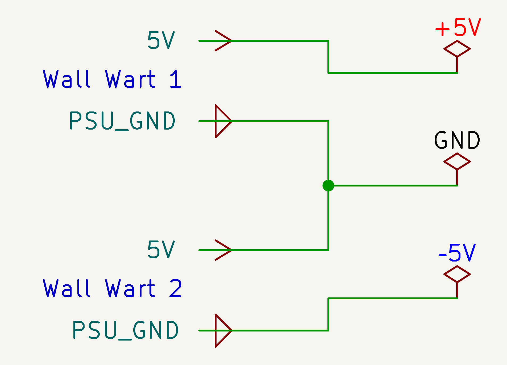

This is a simple and inexpensive solution: two small wall warts cost around $2 each. Enclosures are not even required—the boards can be removed from their cases and soldered directly together to save space. The boards themselves are roughly the size of two coins, and the most bulky component ends up being the mains power cord.

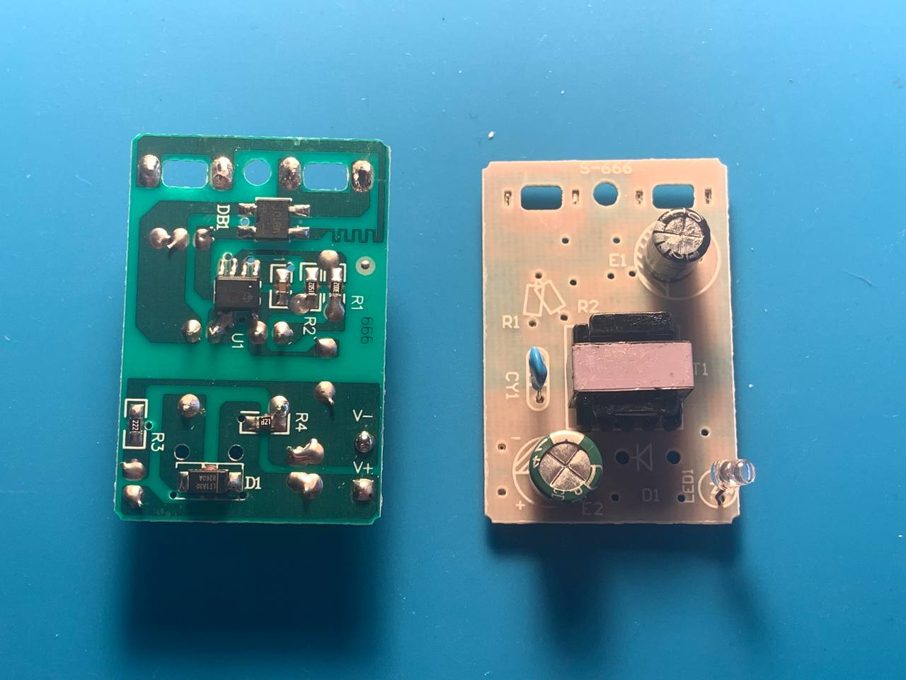
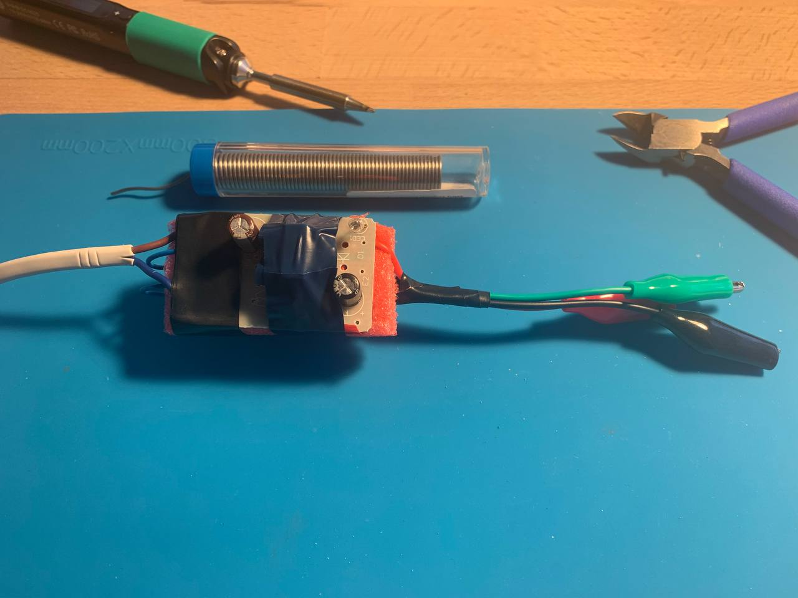

This approach shows great results, with accuracy within about 5%, which should be acceptable for most older chips such as the [AD1851](https://www.analog.com/media/en/technical-documentation/data-sheets/ad1851_1861.pdf), where the allowed supply range is 4.75 V to 5.25 V. No obvious noise is observed on the outputs, and additional capacitors are not strictly required.

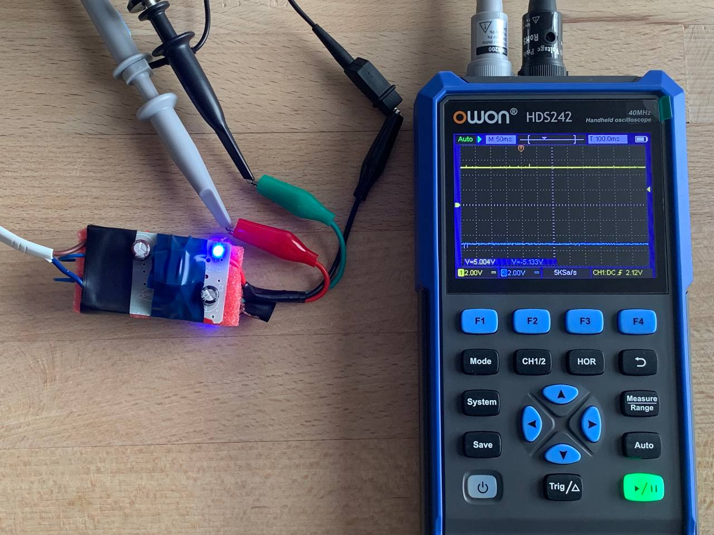

If an adjustable PSU had not been available, this is the solution I would have settled on. It works very well.

## L7805 Voltage Regulator and Adjustable Power Supply

This is a fairly elegant solution that allows the input 10 V to be split into two rails, +5 V and −5 V, using a single voltage regulator. However, an adjustable power supply is required, since the voltage regulator has a small voltage drop. To obtain an accurate +5 V output, the input must be set to approximately 10.10–10.20 V.

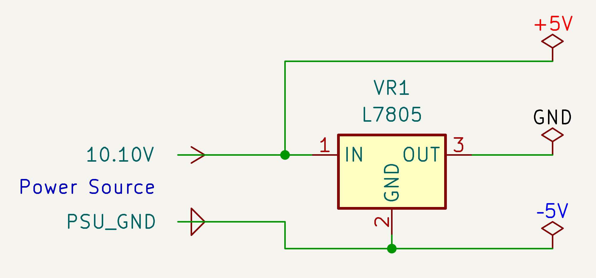

A major drawback is that the schematic ends up with two different ground references, and it is easy to damage an IC by confusing them. [My question on Reddit](https://www.reddit.com/r/diyaudio/comments/1q0lljl/dac_ic_ad1851_wiring_and_protocol_help_needed/) illustrates exactly this failure mode: after an incorrect Arduino connection, −5 V was applied to the SPI bus, resulting in device damage.

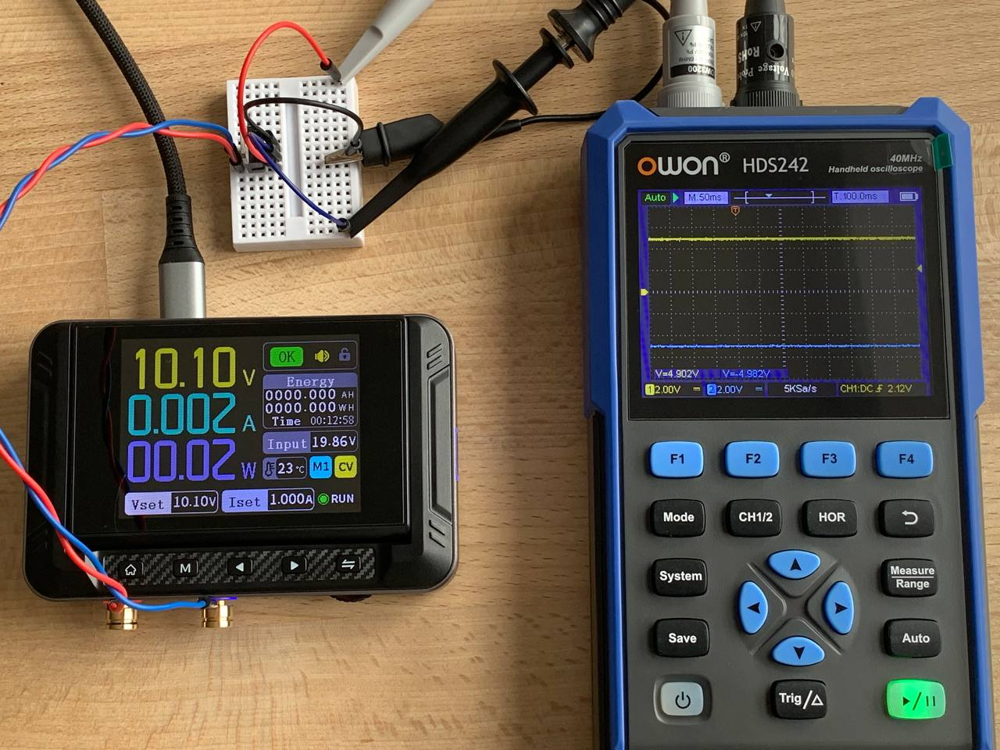
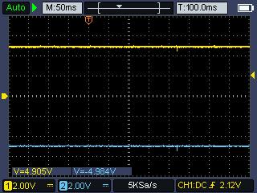

The results are very stable. This is the method I use to power the AD1851, since it requires adding only a single additional voltage regulator to the existing breadboard wiring.

## Two L7805 Voltage Regulators and 12-18V Power Supply

This approach is suitable when an unregulated power supply in the 12–18 V range is available. Higher input voltages were not tested, but the same principle should apply.

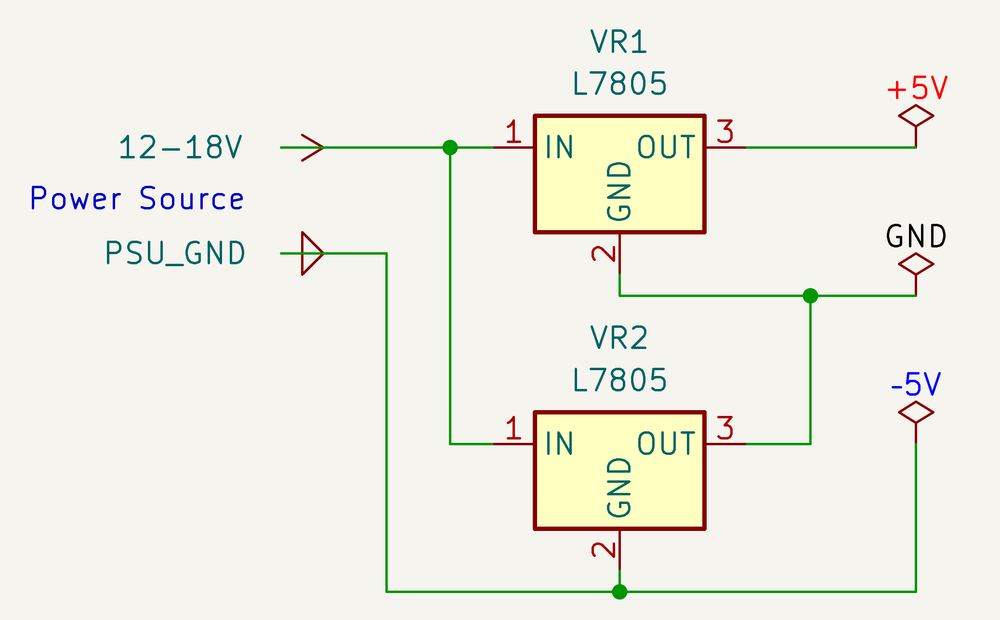

The circuit itself is fairly simple, but it inherits the same drawback as in the previous section: the schematic ends up with two different ground references, which are easy to confuse.

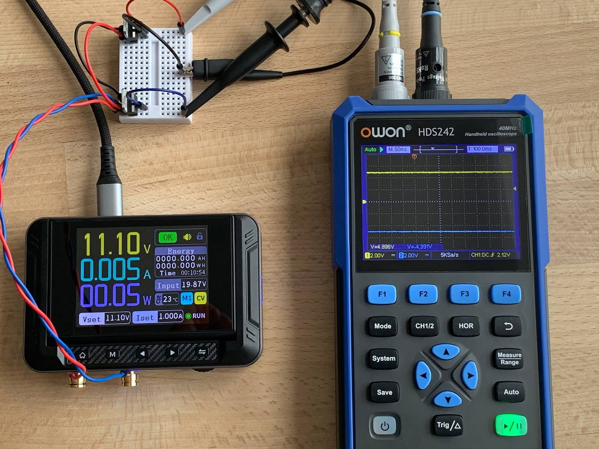
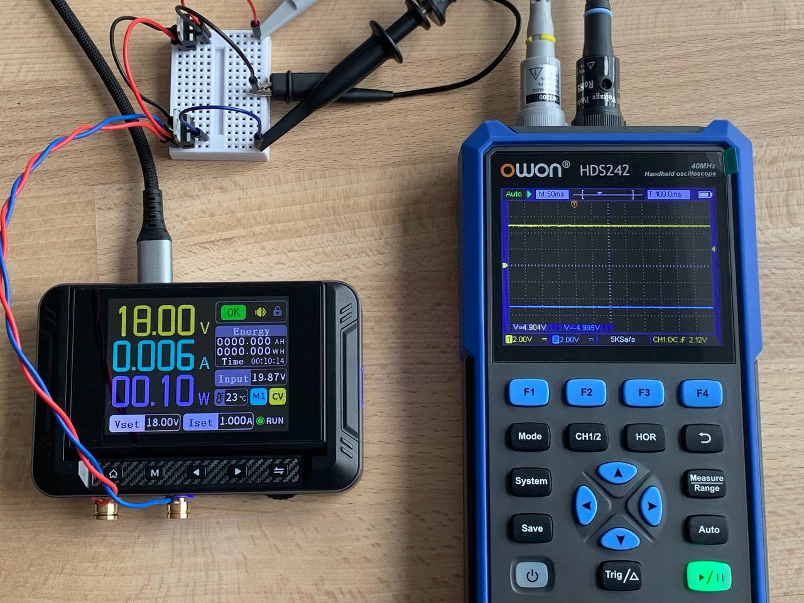

This approach produces stable results. In the photos above, the input voltage is swept from 11.10 V up to 18 V, and the voltage regulator outputs remain unchanged.

## Dual Output Buck-Boost, L7805 + L7905 Voltage Regulators and 5V Power Supply

This solution can be useful when no power source above 10 V is available and a dual-output buck-boost converter happens to be on hand.

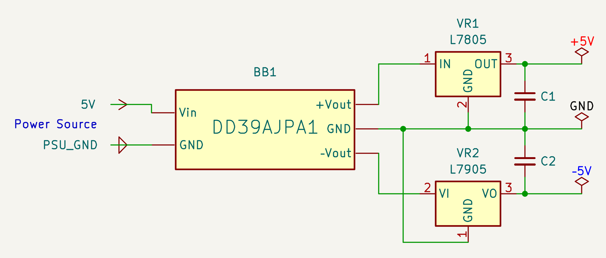

First, the buck-boost converter was adjusted to generate 7 V on the positive rail, which resulted in 7.5 V on the negative rail.

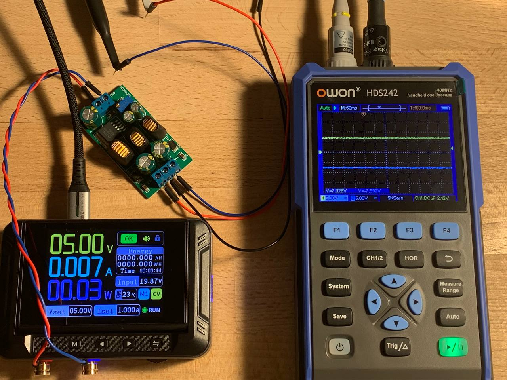
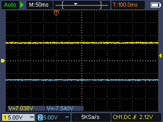

After that, two voltage regulators were added to the circuit—one for the positive rail and one for the negative rail—resulting in output voltages within the acceptable tolerance range.

It is worth noting that the L7905 is a very noisy voltage regulator. Instead of a steady −5 V, it produces a high-frequency sinusoidal waveform around that level, with fluctuations of up to 0.5 V. An output capacitor is required to smooth the noise; after adding it, the system shows good results. A similar capacitor was also added to the L7805, although this is not strictly necessary.

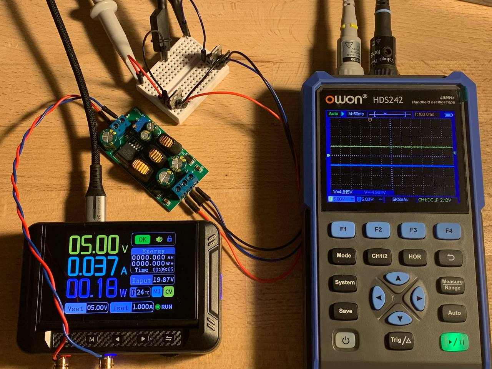
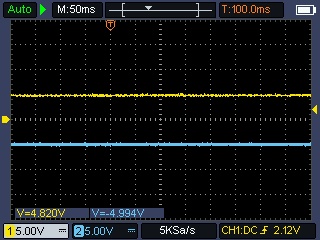

I purchased this board purely for experimentation, and it does not seem particularly useful for my projects. The primary reason is that the mismatch between the positive and negative rails can reach up to 0.5 V, which makes it unusable without voltage regulators anyway. Additionally, the buck-boost converter together with two voltage regulators consumes nearly 20× more power. This setup may be useful in scenarios where only two AA batteries are available but a 5 V supply is required. That, however, is not my use case.

## ⚠️ Two Adjustable Power Supplies, Fnirsi DPS-150

**Spoiler Alert**: it doesn't work

When tying together two wall warts worked, the next idea was to emulate a dual-channel power supply with a common ground by applying the same principle to two independent DC adjustable power supplies. In the case of the DPS-150, this would have saved a significant amount of space, since these are pocket-sized tools rather than bench units, potentially resulting in a fully functional variable ± power supply.

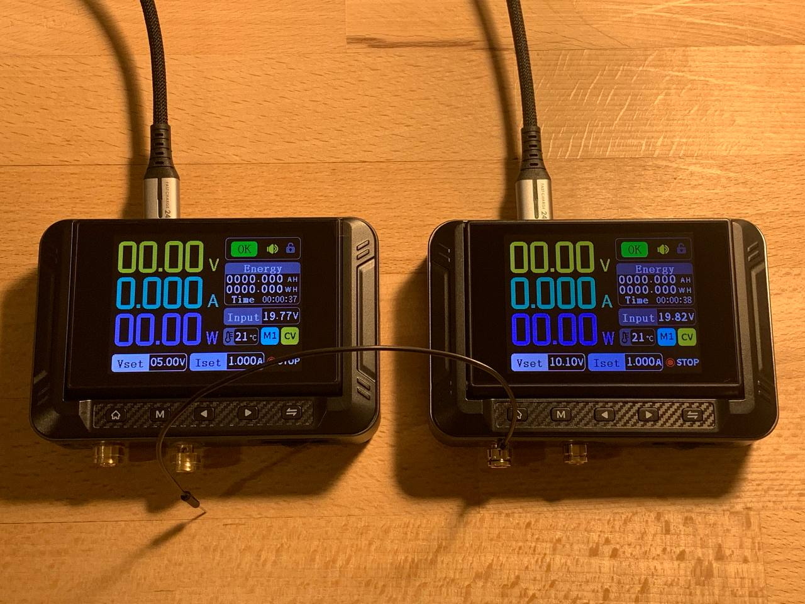

This approach did not work. When the positive output of one supply was connected to the negative output of the other, a spark occurred, one of the power supplies tripped its protection circuitry, and then rebooted. The trick failed.

## Next Steps

Next, the plan is to build a setup with two DACs, work out their SPI connection to an Arduino, and generate two phase-shifted sine waves for the oscilloscope XY mode to produce Lissajous curves.