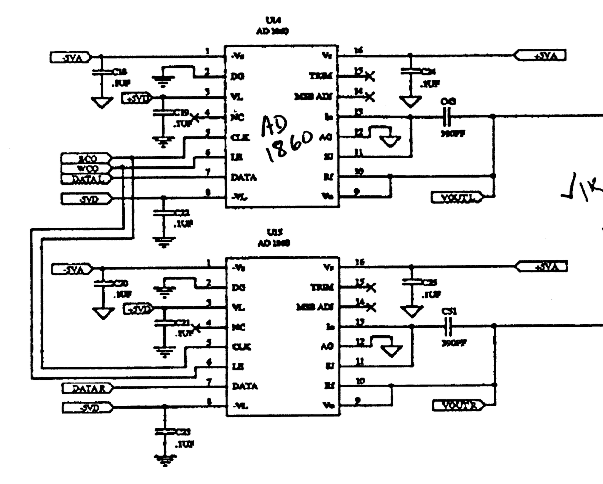
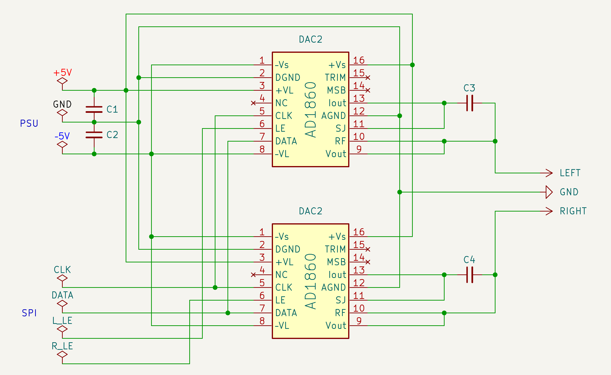
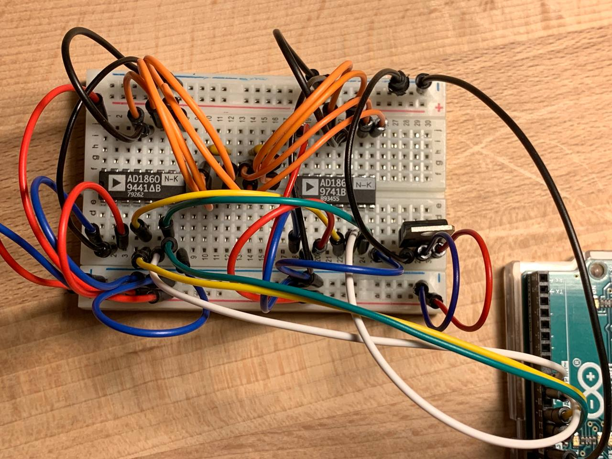
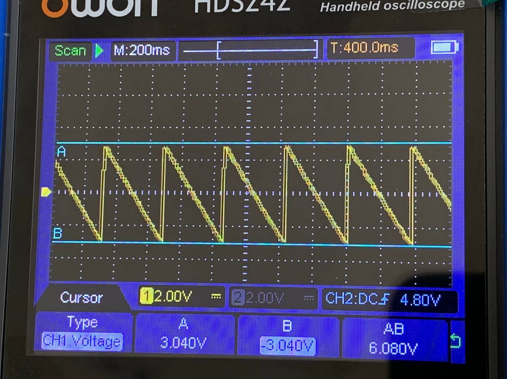
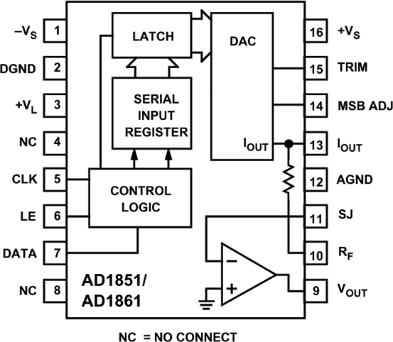
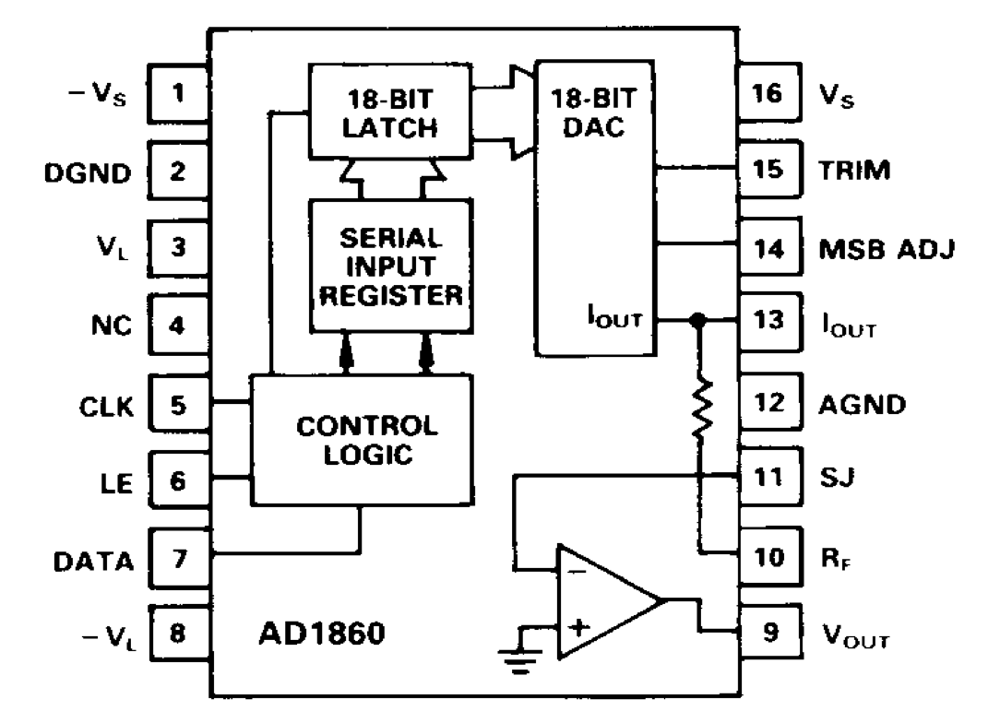
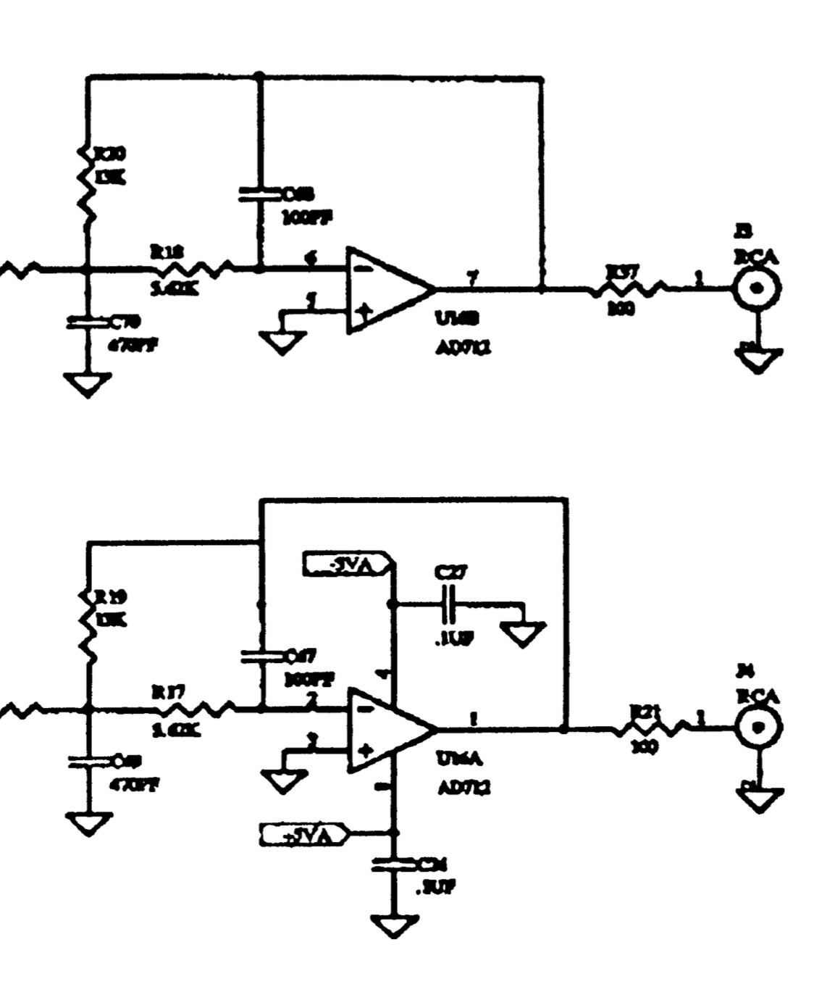

## TLDR

I spent several weeks trying to connect the AD1851 to an Arduino and obtain a sine wave on my oscilloscope. Since I am a newcomer to the world of digital audio—and especially to digital audio from the 1980s—I approached many things incorrectly. I destroyed my first chip outright by applying −5 V to the SPI interface; I discussed this issue in [my reddit post](https://www.reddit.com/r/diyaudio/comments/1q0lljl/dac_ic_ad1851_wiring_and_protocol_help_needed/).

First, I had to sort out the power supply. I had not previously encountered a negative rail in microelectronics. I described this in [my previous blog post](/blog/dac-spi-1-power-supply/). I tried several approaches and eventually settled on a solution based on a single voltage regulator.

In this post, I describe how to correctly connect AD18xx ICs in a DIP-16 package; there are several variants and multiple generations, like AD1860, AD1851 and AD1856.

## Wiring Diagram

By sheer luck, I managed to find a [thread on an forum from the early 2000s](https://www.diyaudio.com/community/threads/ad1860-datasheet-for-audio-alchemy-dac.34247/post-395888) that contained a schematic from the early 1990s showing a dual channel AD1860 setup. This finally allowed me to wire the chip correctly and observe an output on the oscilloscope. It was not yet a sine wave—SPI deserves a separate post—but at least it was no longer a static line.

The wiring follows the original diagram, with one key difference: the original design uses a shared `LATCH ENABLE` and separate `DATA` lines, whereas my setup uses a shared `DATA` line and separate `LE`s for the left and right channels. Since the microcontroller is single-core, this makes little practical difference. Later, I will review the SPI nuances specific to digital audio and adopt best practices. For now, this distinction is not particularly important—the primary goal is simply to make it work.

I assembled everything on a single breadboard together with the voltage regulator, primarily for compactness. The Arduino and the SPI interface are powered directly from USB; this works as expected, and the voltage levels match the datasheet specifications.

After a few simple experiments with the Arduino sketch, I was able to generate a sawtooth wave on a single channel across the full −3 V to +3 V range.

## Connecting Vout and Iout

I initially connected everything exactly as shown in the old schematic, and it worked. I then began disconnecting individual sections to observe which parts were essential for operation and which were not.

Connecting `Vout` and `Iout` through a capacitor, as shown in the old schematic, does not change the behavior; everything works the same without this capacitor. I assume this was done to reduce the noise level. Since I do not yet fully understand these nuances, I am simply copying established reference designs.

## AD1851 vs AD1860

The difference between the AD1851 and the AD1860, aside from bit depth, is that the AD1851 does not use −5 V for its logic, so pin 8 remains `NC`, whereas the AD1860 uses both the positive and negative rails for logic as well as for the analog section. From a usage perspective, this makes no practical difference in my case, since I connect these two domains anyway. However, during wiring it is critical not to make a mistake. An unexpected −5 V on pin 8 would likely destroy the chip; applying −5 V to the SPI interface certainly does—I have verified this firsthand.

## Amplifier

The datasheet for these DAC ICs states that they already include an output amplifier, and this is consistent with what I observe on the oscilloscope: the chip produces a clean ±3 V output. I have not connected headphones and cannot say whether this would work in practice.

However, the old schematic includes an additional stage at the output. I cannot read the IC type on that diagram, but I assume it is an external amplifier.

Just in case, I bought an LM386 — both as a bare DIP-8 IC and as a small breakout board intended for Arduino. I will experiment with it later.

## Next Steps

The remaining task is to sort out the SPI interface. There are indications that my Arduino implementation has bugs.

A custom implementation is required, because the standard Arduino `shiftOut()` operates on byte-sized values, and transmitting 18 bits without generating an extra `CLK` edge is not possible.