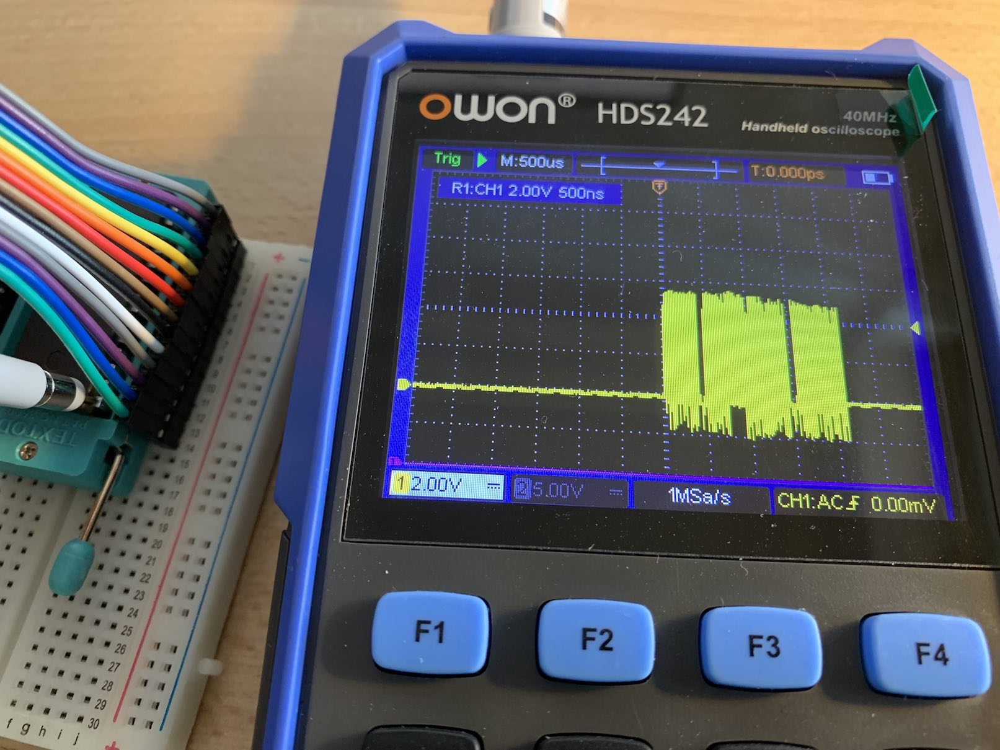

**EEPROM API** is my project for reading and writing the 28C64 EEPROM, while also helping me learn:
* how the EEPROM chip works and what its limitations are
* how to create a virtual environment for this chip using Arduino
* how to translate waveforms from the datasheet into C++ code
* how to make this code both efficient and reliable

Here are a couple of introductory articles ([EEPROM Read and Write Operations with Arduino](https://dev.to/inn-goose/eeprom-read-and-write-operations-with-arduino-2ll4), [EEPROM 28C64 API Performance with Arduino](https://dev.to/inn-goose/eeprom-28c64-api-performance-with-arduino-2g20)) on the topic and the project itself on [GitHub](https://github.com/inn-goose/eeprom-api-arduino), still in development.


### TLDR


The goal was to verify that data read by the EEPROM API matched the output from a hardware programmer. Initial results showed corrupted and inconsistent data. I tested multiple hypotheses: experimenting with bit ordering, checking address and data pins with a logic probe and oscilloscope, replacing ribbon cables with jumper wires, and isolating the address and data buses. These experiments suggested noise on the data pins, while address pins appeared stable.

Further inspection revealed the actual cause: several address pins on the Arduino were not properly initialized. The unconnected pins produced unstable waveforms that looked like noise and led to corrupted reads. Correcting the initialization resolved the issue. The API now produces stable results identical to the reference programmer, and the next step is adding write operations and a CLI.


## Programmer Used as Reference

I use the XGecu T48 Programmer and the `minipro` CLI for writing to and reading from EEPROM.


`minipro` write command:
```bash
minipro -p AT28C64 -s -u -w ./dump.bin
...
"-u" unlocks the chip for writing
"-s" allows to write shorter dumps
```

`minipro` read and `xxd` print commands:
```bash
minipro -p AT28C64 -u -r ./dump.bin && xxd dump.bin
...
"-u" unlocks the chip for writing (hack)
```

The main goal of this debugging exercise is to verify that the read results from both the programmer and the EEPROM API are effectively identical. However, this is not the case in the initial state.

I have prepared several binary dumps with test data: an FF pattern, a 00 pattern, an EF pattern, and a dump from a real EEPROM taken from an old computer. The [real EEPROM dump](https://github.com/misterblack1/zenith_zt1/blob/main/444-187%20U114%20ROM%202732.bin) contains lines of text that I'll use as reference points for comparison.
```bash
$> xxd ./444-187\ U114\ ROM\ 2732.bin
...
00000f70: 0ff0 d0e0 2241 6e73 7765 7220 566f 6963  ...."Answer Voic
00000f80: 6520 6361 6c6c 2c20 7072 6573 7320 5245  e call, press RE
00000f90: 5455 524e 2000 5072 6573 7320 4845 4c50  TURN .Press HELP
00000fa0: 0050 7265 7373 2051 5549 5420 746f 2065  .Press QUIT to e
00000fb0: 7869 7400 904f 4e20 4c49 4e45 8020 0080  xit..ON LINE. ..
...
```


## Initial State and [Bit Numbering](https://en.wikipedia.org/wiki/Bit_numbering)

I configured the EEPROM API serial output to match the format of `xxd`, making it easier to compare results and check lines by their addresses. I use `arduino-cli` to read serial data from the microcontroller because it lets me record the entire output. The Arduino IDE serial monitor's copy-paste feature doesn't work properly for this.

`arduino-cli` read serial:
```bash
arduino-cli monitor -p <Port> -b <Fully Qualified Board Name> --config 115200
...
to get the "-p" and "-b" values use "arduino-cli board list"
```

The first run produces completely unreadable output.
```bash
...
00000f70: ff0f 0b07 4482 76ce eea6 4e04 6af6 96c6  ....D.v...N.j...
00000f80: 2a04 e786 3636 3426 0e4e a6ce ce05 6ba2  *...664&.N....k.
00000f90: ffff ffff ffff ffff ffff ffff ffff ffff  ................
00000fa0: ffff ffff ffff ffff ffff ffff ffff ffff  ................
00000fb0: ff96 be5e 1dfe ff04 3e92 ffff 61ff ffff  ...^....>...a...
...
```

I haven't yet run the program with real data, and I'm not sure whether the address space and bit numbering are configured correctly. So I'm experimenting with *LSb* and *MSb* ordering to convert voltages on the data pins into `uint8_t` values. This yields an immediate result: the *MSb* for the data bus works. However, the addressing is still incorrect, and only part of the original text appears in the output.
```bash
00000f70: fff0 d0e0 2241 6e73 7765 7220 566f 6963  ...."Answer Voic
00000f80: ffff ffff ffff ffff ffff ffff ffff ffff  ................
```

I experimented with the address space and tried both orders to get a readable result. However, this didn't help; with *MSb* ordering, there is no data at all. Assuming *LSb* is the correct ordering but the address routing has issues, I needed to investigate further.
```bash
00000f70: ffff ffff ffff ffff ffff ffff ffff ffff  ................
00000f80: ffff ffff ffff ffff ffff ffff ffff ffff  ................
```

Therefore, I returned to *LSb* and tried to understand the causes of incorrect addressing. I enabled DEBUG mode with a display of the bitwise representation of the address and immediately noticed strange behavior. The conversion from a `uint16_t` address to bits is correct — `0f70` equals `0111101110000` in 13-bit representation. But since the last run, the data has changed! Several consecutive runs give me different data.
```bash
00000f70 [0111101110000]: fff0 d0e0 2241 6e73 7765 7220 566f 6963  ...."Answer Voic
00000f80 [0111110000000]: 74a0 ff71 7c6c 6ef0 7872 7573 73e5 524f  t..q|ln.xruss.RO
```
```bash
00000f70 [0111101110000]: fff0 d0e0 2241 6e73 7765 7220 566f 6963  ...."Answer Voic
00000f80 [0111110000000]: 5524 6761 ed6c 6fa0 7472 7d73 7331 726f  U$ga.lo.tr}ss1ro
```

At the same time, running the programmer shows stable results, and the data in the chip's memory remains unchanged.
```bash
00000f70: 0ff0 d0e0 2241 6e73 7765 7220 566f 6963  ...."Answer Voic
00000f80: 6520 6361 6c6c 2c20 7072 6573 7320 5245  e call, press RE
```

Thus, the conversion of bits from the chip's memory into byte values works correctly—I can see sections of readable text. However, the addressing is faulty and returns random data for the same address.


## Addressing and Dummy Patterns

The random data returned by the EEPROM API doesn't seem entirely random; it looks like the system is returning correct data—but from different addresses, as if the addressing is disrupted. To verify this, I decided to test the system with two dummy patterns, `FF` and `EF`. If only the values `E` and `F` appear in the output, then the issue is definitely with the addressing.

Writing the entire EEPROM space with `FF` using the programmer and then reading the data with the EEPROM API shows no anomalies, as the whole address space is filled with `FF` values. Even if the addressing is broken, it still returns `FF`.
```bash
00000000: ffff ffff ffff ffff ffff ffff ffff ffff  ................
00000010: ffff ffff ffff ffff ffff ffff ffff ffff  ................
... same ...
```

No anomalies were detected for the `EF` pattern either. This gives me some insight into the addressing issue. It seems that only the higher address bits are affected, as I don't observe any mixing with the `EF` pattern. In general, I can see the entire line—though it's somehow corrupted, it's still complete.
```bash
00000000: efef efef efef efef efef efef efef efef  ................
00000010: efef efef efef efef efef efef efef efef  ................
... same ...
```

The software part seems correct, but the chip is mixing up data for different addresses. It's time to measure the voltage levels on all the chip's pins and check for discrepancies between the data set by the program for the addresses and the actual voltage values.


## Noise Investigation

I decided to determine whether the program sets the addresses for reading memory cells correctly. To do this I used a logic probe and checked each pin of the chip. The check showed two pins with no visible signal, as if they were not connected. Assuming the logic probe has limited sensitivity I verified the configuration with an oscilloscope.


I use a delay inside the data reading function to pause the program, which allows me to measure the signals on all pins.
```cpp
  if (address == 3967) delay(1000000);
```



I enabled debug output in the API to display the digital states of the address and data pins, where `0` corresponds to *0V* and `1` corresponds to *5V*. Address `b0000000111110` returns the value `b11000110` or the ASCII letter `c`. The oscilloscope readings for the address and data pins match the log output, showing the expected bit pattern. This confirms the value is correct.
```
(API) READ [3967] | addr[LSb]: b1111111011110 | data[LSb]: b11000110
```


Address `b0000000111110` should contain the ASCII letter `e`. The oscilloscope capture shows the expected *LSb* value `10100110` on the chip's pins, but the zero levels are noisy, with spikes reaching up to *5V*. The program reads an incorrect value of `b11111111` due to the noise, which is visible in the debug log. The noise caused misreadings, leading the microcontroller to interpret a noisy zero as one. We observe this behavior: all data pins are read as ones instead of the actual mix of zeroes and ones.
```
(API) READ [3968] | addr[LSb]: b0000000111110 | data[LSb]: b11111111
```

I detected noise on the data pins, while the address pins remained stable. My next hypothesis was that the ribbon cable might introduce electrical interference. I decided to rewire the connection between the chip and the microcontroller using jumper wires.


## Rewiring

I suspect that the ribbon cable may introduce electromagnetic noise, or that the Dupont connectors themselves add noise, since management, address, and data pins are mixed at the connection points. Previously, using regular jumper wires, this behavior was not observed. I replaced the ribbon cable with jumper wires and repeated the experiment.


Replacing the ribbon cable with regular jumper wires did not help; the noise remained. The oscilloscope records the same amount of noise on the `I/O4` pin. 


The program continues to return the same corrupted data with the new wiring as before. It reads `b11111111` instead of `10100110`.
```
(API) R [3968] | addr[LSb]: b0000000111110 | data[LSb]: b11111111
```


Additionally, I observed that the noise for a logical `1` appears as a drop to `0`. Consequently, values can sometimes be misread, with a `1` interpreted as `0`. This is clearly visible in the initial experiment, where letters in words appear scrambled.

Since the noise persists with the new wiring, I decided to test another hypothesis: isolating the data pins from the address pins to identify the possible source of the noise.


## Isolating Address and Data Pins

My next assumption is that the crossing of address bus wires and data bus wires may introduce noise into the data bus. Since the data is corrupted only for specific addresses, I suspect that some address bus wires are causing interference. To test this hypothesis, I connected the data bus to the Arduino, while connecting the address bus directly to the `5V`/`GND` rails of the breadboard, isolating the Arduino's influence on the address bus.

[Sketch]() with the source code.

This produced a result. The address that previously showed noise on the address pins displayed clean values for both logical 0 and 1. The serial console showed the same value consistently, indicating that the data is read reliably and no noise is introduced.


After connecting the three most significant bits of the address space to the Arduino, setting them to the values that previously caused noise, I checked whether interference appeared on the address bus. No interference appeared on the data bus. The Arduino consistently read the same value, and oscilloscope verification showed a stable, noise-free signal.


I decided to carefully check the signal on each chip pin during a full read cycle, hoping to spot an anomaly I had missed before. To do this, I reconnected the chip to the Arduino.


## Full Pin Check

I checked each pin of the chip with the oscilloscope during the read operation, starting with the left side while the right side was disconnected, to rule out interference, as I suspected some pins on the right might be causing it. But this gave no visible results; the signal looked as expected, with clear zeros and ones.


After that, I connected the right side and detected an anomaly. The signal on the address pins looked incorrect: instead of digital square waves, the oscilloscope displayed a sawtooth pattern. Moreover, after the read operation finished, instead of a steady *0V*, the oscilloscope showed a noisy trace resembling interference rather than a true logical zero. At the same time, this behavior appeared only on the address pins. The control pins looked normal, and the oscilloscope showed a proper digital signal on them.


This stark difference in behavior led me to suspect that these pins might be unconnected or improperly configured for digital signals. I checked the code and realized that I had incorrectly initialized the address pins, using the data bus size constant instead of the address bus size, leaving the top five address pins uninitialized.


Correct initialization of the upper address pins solved the problem. The sawtooth trace turned into a proper digital trace, and the random oscillations around *0V* disappeared. In the end, it turned out that incorrectly initialized digital pins can introduce unwanted interference and cause unstable chip behavior. This was difficult to trace, because the sawtooth trace was still generated despite the uninitialized Arduino output pins, and occasional correct operation made the issue misleading.


## Root Cause: Oscilloscope View of Misconfigured Pins

A proper digital zero on the oscilloscope appears as a straight horizontal line.


An unconnected pin, by contrast, shows random oscillations above and below *0V*.


A good digital signal trace shows clean *0V*-*5V* columns of ones with proper intervals.


A bad oscilloscope trace appears as an unclear sawtooth, with values not dropping to *0V* and staying near *5V*, with small dips to *4V*.


## Summary and What I Learned

Thus, the root cause is this: improperly initialized Arduino pins behave unpredictably, and attempts to set digital signals on such pins produce varying results that are not tied to the program logic. This can appear as interference on other pins of the chip, because the EEPROM is designed for specific input waveforms and strict sequencing. Now I know how unconnected pins appear on the oscilloscope and how the chip behaves in this case. In the future, this will allow me to quickly identify this class of problems.

I also realized that the logic probe showed the correct result: there was indeed no signal on the unconnected pins. I had mistakenly assumed this was a limitation of the tool, but in fact it was accurate. Therefore, an oscilloscope is not strictly necessary to detect this type of issue.

I began the bisect with fairly complex operations, assuming faulty hardware behavior. In this case, however, it turned out to be a software problem of my own making. For popular hardware products, the chance of an actual hardware fault is relatively low; most often, the issue lies in my own code.

The program runs stably and produces results identical to the reference.
* [./data/reference.out]()
* [./data/eeprom_api_fixed.out]()
```
diff ./data/reference.out ./data/eeprom_api_fixed.out
... no differences ...
```

Now I can move forward and publish the first version of the library, verified against the reference and producing stable read results. Next, I will focus on write operations and the CLI interface, taking into account the limitations of the serial bus.
