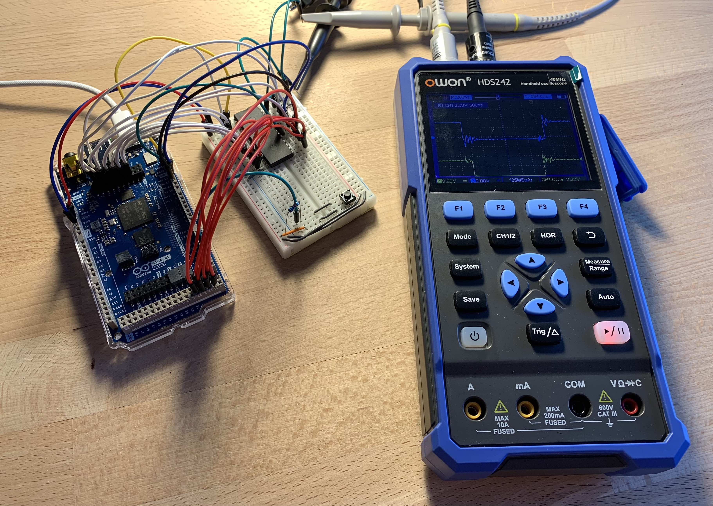
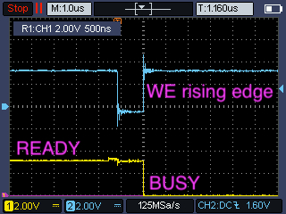
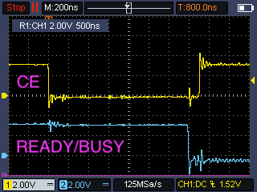
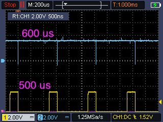

## Motivation

In my previous post, I described a basic implementation of the EEPROM Programmer and demonstrated, in a simple example, how to read and write a few data cells. At that point, performance and operation speed were not important, as the goal was only to provide an initial demonstration.

Now I focus on improving performance and comparing the EEPROM datasheet values with the actual operation speed. This should not be considered a precise experiment on measuring the raw speed of the chip itself, because the Arduino platform inevitably introduces certain performance limitations by adding some overhead. The goal is to make the read and write API operations as fast as realistically possible while taking platform constraints into account.

To achieve this, I follow the pin activation sequence from the datasheet waveforms and respect the timing requirements, such as the Write Cycle Time. I eliminate unnecessary waiting functions and use an oscilloscope to illustrate how the write waveforms appear in practice.




## Read Waveforms


The sequence of pin activations required for reading data from the EEPROM is straightforward.

Read Operation Steps:
1. Set the address on the `Address Bus`
2. Enable the Chip by setting `CE` pin to `LOW`
3. Enable the Output by setting `OE` pin to `LOW`
4. (*) Wait for the `OE` to Output Delay Time
5. Read the cell value on the `Data Bus`
6. Disable the Chip by setting `CE` pin to `HIGH`
7. Disable the Output by setting `OE` pin to `HIGH`

Step 4* is the critical step, where Arduino platform overhead becomes evident. The EEPROM datasheet specifies that the delay between setting the `OE` pin `LOW` and the value appearing on the Data Bus is 10–70 ns for this model.


However, as the oscilloscope measurements indicate, the time between two pin write operations is about 120 ns. This is execution overhead, since the program is written in C and each function expands into a large set of low-level instructions. This delta between operations is sufficient for the value to appear on the Data Bus.

The Arduino Giga runs at 240 MHz, 20x higher than the Mega’s 16 MHz, so the overhead between pin writes may scale accordingly. I plan to run measurements of this kind in a future article.


## Write Waveforms


The operations required for writing data are more complex and require polling of the `READY/BUSY` pin to determine when the write process has completed.

Write Operation Steps:
1. Set the address on the `Address Bus`
2. Enable the Chip by setting `CE` pin to `LOW`
3. Enable the Write by setting `WE` pin to `LOW`
4. Set the value on the `Data Bus` (~1us, see below)
5. Disable the Write by setting `WE` pin to `HIGH` (initiates the write)
6. Disable the Chip by setting `CE` pin to `HIGH`
7. (*) Poll for the `READY` status

The datasheet specifies two timing intervals important for implementing Chip Status Polling:
* **Time to Device Busy** – the time between the `WE` pin rising edge and the `READY/BUSY` pin transitioning to `BUSY`, maximum 50 ns
* **Write Cycle Time** – the time required to write data into the chip’s memory, maximum 1 ms

I added a 1 µs wait for the **Time to Device Busy**, though this is unnecessary given the platform overhead.

For status polling, the mechanism is:
* If the chip is in the `BUSY` state at the start of polling, check every 200 µs until it transitions to `READY`, with a 1.4 ms timeout
* Alternatively, simply wait 1.4 ms using a standard `delay()` function

The `READY/BUSY` status pin uses an **Open Drain Output** connection, so it must be set to `INPUT_PULLUP` mode for reading, or use an external pull-up resistor.

I covered the performance details of polling in the next section.


The relationship between the `CE` (yellow) and `WE` (blue) pins, and their behavior during the write operation, is shown above. The `CE` pin is pulled `LOW` to activate the chip. Then, the `WE` pin is pulled `LOW`, marking the start of placing a value on the Data Bus. The duration between the falling and rising edges of the `WE` pin is about 1200 ns, which corresponds to roughly 8 write operations at 120 ns each, plus the overhead required to set the value on the bus. The rising edge of `WE` initiates the data write process. The rising edge of `CE` no longer affects the operation, as can be seen from the waveforms.



Previously I misread the waveforms. `WE` (blue) does indeed trigger the data-write operation on the rising edge, transferring the chip into the `BUSY` state (yellow). This is confirmed by the oscilloscope measurements shown in the image above.



Setting the chip to inactive mode by driving the `CE` pin `HIGH` does not affect the data write process, as shown in the image above.


## Polling `BUSY` State

Active polling of the `READY/BUSY` pin halves the write time.

Oscilloscope measurements show that a write takes about 500 µs, compared to the specified maximum of 1000 µs. However, even waiting manually for the maximum period can cause occasional write errors. If a new write cycle begins before the previous one has completed, it can corrupt the data from the previous cycle by placing new values on the Data Bus. For reliability, the minimum wait time is set to 1400 µs.




Chip status polling, however, reduces the waiting time from 1400 µs to 600 µs without compromising write reliability. Two oscilloscope waveforms show this difference. In the first image, the program simply waits 1400 µs. In the second image, the program actively polls the chip status and returns control from the write function as soon as the chip enters the `READY` state.

This time could be further reduced by lowering the poll interval to 50 µs, theoretically reducing wait by a factor of three.


## Performance

[GitHub Project with the Performance API](https://github.com/inn-goose/eeprom_arduino/tree/main/eeprom_performance)

old API implementation:
```
WRITE | TOTAL: 8193044 us | AVG: 8001 us
READ | TOTAL: 15371674 us | AVG: 15011 us
VERIFY: OK
```

performance API implementation:
```
BUSY | TOTAL: 615502 us | AVG: 601 us | MAX: 605 us
WRITE | TOTAL: 622457 us | AVG: 607 us
READ | TOTAL: 4672 us | AVG: 4 us
VERIFY: OK
```

I executed sequential write operations followed by read operations. I wrote 1024 cells sequentially with random values, storing them in an array. Then I read the same 1024 cells one by one, storing the read values in another array. During each write operation, I also recorded in an array the waiting time for the chip’s `READY/BUSY` pin status, since this constitutes the main execution time consumption during writing.

The results of an old API implementation are not useful for comparison, as the first API version was optimized for visual demonstration rather than speed. It is more relevant to compare results against the maximum expected values from the datasheet.

I determined that a single digital pin read/write operation takes roughly 120 ns. Each write involves 25 digital operations, about 3000 ns, plus array conversion, totaling ~4000 ns, consistent with measurements. Caching the mapping between address values and bit representation could accelerate single-cell reads by 5–10%. However, this optimization is unnecessary, as the entire 8K address space can be read in 40 ms.

For write operations, the picture is similar regarding execution overhead. The average operation execution time is 607 µs, with an average `READY/BUSY` pin polling wait of 601 µs, leaving about 6 µs for Arduino-side operations. This is slightly higher than for reading, due to data conversion and a 1 µs `delay()` before polling. The polling process itself could be sped up by checking the status every 20 µs, reducing total wait time by roughly 100 µs.

The achieved read values are strong, as the datasheet specifies a maximum wait of 1 ms, whereas I achieve 0.6 ms.


## Data Verification

After completing the write and read blocks, I compare the arrays to verify data and check for errors. If writes are performed too quickly, operations overlap and data integrity suffers. For example, reducing the `READY` wait time from 1.4 ms to 0.2 ms results in almost all cells being written incorrectly.

This verification is unrelated to the corruption discussed earlier, since here writes and reads occur in a single operational cycle. Detecting potential memory degradation of the chip requires performing a power cycle between write and read operations, which will be the topic of a future article.


## Next Steps

(1) Check how many write cycles the new EEPROM chip supports and examine endurance degradation, whether as slower write speeds or as data corruption.

(2) Write a program to verify data stored on the EEPROM chip and test retention over a 24-hour period (datasheet specifies 10 years).

(3) Assemble a breadboard setup with a ZIF socket to enable quick replacement of EEPROM chips for validation and verification.

(4) Compare the overhead of `digitalWrite()` and `digitalRead()` operations on Arduino Mega and Arduino Giga, accounting for the 20x clock-speed difference.
