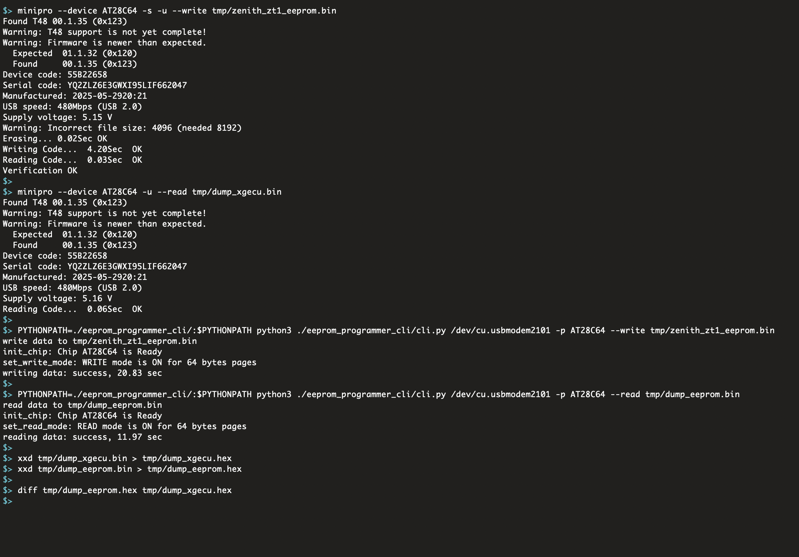


Note, that Arduino has one unexpected behavior: when connecting over the Serial interface, the board **resets** and completely loses its internal state. If using the Arduino IDE, this behavior can be observed by simply opening and closing the Serial Monitor. This is not a peculiarity of the Python serial library implementation but rather a built-in characteristic of the Arduino platform itself.



Note, that during this reset period, all board pins remain in an **uninitialized** state for about two seconds on an UNO R3. I described the details in the [Misconfigured Arduino Pins](/blog/experiments-2-misconfigured-arduino-pins/#how-arduino-behaves-during-the-reset) post.



During read operations with the EEPROM Programmer, the chip's `!WE` pin **MUST** be connected to `VCC` using a jumper wire to disable the write mode. Otherwise, invoking the CLI may corrupt data on the chip due to Arduino's internal behavior.


## TLDR

This post describes the **JSON-RPC API** implementation applied to the [EEPROM Programmer](https://github.com/inn-goose/eeprom-programmer) project. Details of the [Serial JSON-RPC library](https://github.com/inn-goose/serial-json-rpc-arduino) itself are covered in a separate post: [Project: Serial JSON-RPC for Arduino]((/blog/project-2-serial-json-rpc-arduino/)). The library abstracts protocol implementation details, enabling focus on business logic on both the programmer and client sides.

Due to the Arduino board’s limited memory, the design follows a “smart client, simple board” model: the client contains most of the business logic, while the board implements only basic read and write operations for the memory chip.

The following sections examine the programmer’s API, its implementation, and CLI usage examples, followed by a comparison between this programmer and the XGecu reference solution to verify correctness.


## Programmer JSON-RPC API

The programmer implements a set of basic operational primitives that the CLI combines to perform read and write operations on the EEPROM chip. This section outlines the API and demonstrates how the programmer’s functionality can be verified directly through the Arduino IDE Serial Monitor.

`init_chip(chip_type: str)`

```json
{"jsonrpc":"2.0", "id":0, "method": "init_chip", "params": ["AT28C64"]}
```

`set_read_mode(page_size_bytes: int)`

```json
{"jsonrpc":"2.0", "id":0, "method": "set_read_mode", "params": [4]}
```

`read_page(page_no: int)`

```json
{"jsonrpc":"2.0", "id":0, "method": "read_page", "params": [0]}
```

`set_write_mode(page_size_bytes: int)`

```json
{"jsonrpc":"2.0", "id":0, "method": "set_write_mode", "params": [4]}
```

`write_page(page_no: int, data: array[int])`

```json
{"jsonrpc":"2.0", "id":0, "method": "write_page","params": [0, [120, 130, 140, 150]]}
```

### Write Operation

To write first 4 bits, send these commands one by one using Arduino IDE's *Serial Monitor* on `115200` baud.

```json
{"jsonrpc":"2.0", "id":0, "method": "init_chip", "params": ["AT28C64"]}
{"jsonrpc":"2.0", "id":0, "method": "set_write_mode", "params": [4]}
{"jsonrpc":"2.0", "id":0, "method": "write_page","params": [0, [120, 130, 140, 150]]}
```


### Read Operation

To read first 4 bits, send these commands one by one using Arduino IDE's *Serial Monitor* on `115200` baud.

```json
{"jsonrpc":"2.0", "id":0, "method": "init_chip", "params": ["AT28C64"]}
{"jsonrpc":"2.0", "id":0, "method": "set_read_mode", "params": [4]}
{"jsonrpc":"2.0", "id":0, "method": "read_page", "params": [0]}
```


## CLI Usage

The core business logic resides in the Programmer CLI component. This section describes the available functions and provides examples of using the programmer to read, write, and erase data on the EEPROM chip.


Note, that the EEPROM chip type must be specified, as each chip has a distinct pin configuration that affects operation. The `--device` argument defines the correct chip type for the session.


Check the [`eeprom-programmer's README`](https://github.com/inn-goose/eeprom-programmer) for the python `venv` init and the `zenith_zt1_eeprom.bin` source.

### Read Operation

```bash
mkdir ./tmp

PYTHONPATH=./eeprom_programmer_cli/:$PYTHONPATH python3 ./eeprom_programmer_cli/cli.py /dev/cu.usbmodem2101 -p AT28C64 --read tmp/dump_eeprom.bin

xxd tmp/dump_eeprom.bin
```

```
00000000: ffff ffff ffff ffff ffff ffff ffff ffff  ................
00000010: ffff ffff ffff ffff ffff ffff ffff ffff  ................
00000020: ffff ffff ffff ffff ffff ffff ffff ffff  ................
...
00001fe0: ffff ffff ffff ffff ffff ffff ffff ffff  ................
00001ff0: ffff ffff ffff ffff ffff ffff ffff ffff  ................
```

### Write Operation

```bash
PYTHONPATH=./eeprom_programmer_cli/:$PYTHONPATH python3 ./eeprom_programmer_cli/cli.py /dev/cu.usbmodem2101 -p AT28C64 --write tmp/zenith_zt1_eeprom.bin
```

result `xxd` after read:
```
00000000: 01c9 0130 af02 0129 d289 3230 af02 017b  ...0...)..20...{
...
00000f70: 0ff0 d0e0 2241 6e73 7765 7220 566f 6963  ...."Answer Voic
00000f80: 6520 6361 6c6c 2c20 7072 6573 7320 5245  e call, press RE
00000f90: 5455 524e 2000 5072 6573 7320 4845 4c50  TURN .Press HELP
00000fa0: 0050 7265 7373 2051 5549 5420 746f 2065  .Press QUIT to e
00000fb0: 7869 7400 904f 4e20 4c49 4e45 8020 0080  xit..ON LINE. ..
00000fc0: 4f46 4620 4c49 4e45 8000 9244 4941 4c49  OFF LINE...DIALI
00000fd0: 4e47 8020 0090 5741 4954 0090 5072 696e  NG. ..WAIT..Prin
00000fe0: 7465 7280 0080 2020 2020 2020 2080 2000  ter...       . .
...
00001ff0: ffff ffff ffff ffff ffff ffff ffff ffff  ................
```

### Erase Operation

```bash
PYTHONPATH=./eeprom_programmer_cli/:$PYTHONPATH python3 ./eeprom_programmer_cli/cli.py /dev/cu.usbmodem2101 -p AT28C64 --erase cc
```

result `xxd` after read:
```
00000000: cccc cccc cccc cccc cccc cccc cccc cccc  ................
00000010: cccc cccc cccc cccc cccc cccc cccc cccc  ................
00000020: cccc cccc cccc cccc cccc cccc cccc cccc  ................
...
00001fe0: cccc cccc cccc cccc cccc cccc cccc cccc  ................
00001ff0: cccc cccc cccc cccc cccc cccc cccc cccc  ................
```


## EEPROM Programmer vs XGecu Programmer


During read operations with the EEPROM Programmer, the chip's `!WE` pin **MUST** be connected to `VCC` using a jumper wire to disable the write mode. Otherwise, invoking the CLI may corrupt data on the chip due to Arduino's internal behavior.


This section uses the [`minipro`](https://formulae.brew.sh/formula/minipro) utility, which served as the basis for my EEPROM Programmer CLI interface, to compare the performance of the developed Programmer with the reference XGecu device.

This comparison represents the core validation step of the project. Its purpose is to ensure that read and write results are fully consistent with those produced by XGecu, confirming data integrity and establishing the reliability of the custom programmer for EEPROM operations.

Check the [`eeprom-programmer's README`](https://github.com/inn-goose/eeprom-programmer) for the python `venv` init and the `zenith_zt1_eeprom.bin` source.

```bash
# write the zenith dump to the EEPROM using XGecu Programmer
minipro --device AT28C64 -s -u --write tmp/zenith_zt1_eeprom.bin

# read the data from the EEPROM using XGecu Programmer
minipro --device AT28C64 -u --read tmp/dump_xgecu.bin

# write the zenith dump to the EEPROM using EEPROM Programmer
PYTHONPATH=./eeprom_programmer_cli/:$PYTHONPATH python3 ./eeprom_programmer_cli/cli.py /dev/cu.usbmodem2101 -p AT28C64 --write tmp/zenith_zt1_eeprom.bin

# read the data from the EEPROM using EEPROM Programmer
# CAUTION: USE !WE and VCC jumper wire
PYTHONPATH=./eeprom_programmer_cli/:$PYTHONPATH python3 ./eeprom_programmer_cli/cli.py /dev/cu.usbmodem2101 -p AT28C64 --read tmp/dump_eeprom.bin

# convert to HEX
xxd tmp/dump_xgecu.bin > tmp/dump_xgecu.hex
xxd tmp/dump_eeprom.bin > tmp/dump_eeprom.hex

# compare
diff tmp/dump_eeprom.hex tmp/dump_xgecu.hex
... same content, empty diff ...
```


