## TLDR

If write capability is not disabled by connecting the `!WE` pin to the `VCC` pin during a read operation, some memory cells will be overwritten with random data, resulting in **data corruption**. This is a side effect of the general "*Arduino-based EEPROM-programmer with Serial interface*" architecture and cannot be corrected at the software level.

Why this happens:

1. When a serial connection is established between the computer and the Arduino, the board resets.

This is normal Arduino behavior. The details of this process are beyond the scope of this post; for reference, search for "*Arduino resets on serial connection*".

2. During the reset, Arduino pins behave unpredictably. The voltage fluctuates with an amplitude of about 2 V.

I analyzed this process in detail in a [separate post with experiments](/blog/experiments-2-misconfigured-arduino-pins/#how-arduino-behaves-during-the-reset), and today’s post demonstrates this behavior in the context of the [EEPROM Programmer](https://github.com/inn-goose/eeprom-programmer) project.

3. According to the [datasheet](https://ww1.microchip.com/downloads/en/devicedoc/doc0001h.pdf), a 2 V amplitude is sufficient to toggle between `HIGH` and `LOW` states on the management `!WE` pin, which means it can trigger a write operation.

This part is somewhat contradictory: measurements show the oscillation amplitude slightly below 2 V, yet the observed data corruption clearly indicates that it’s enough to initiate a write.

As a result, random values appear in random memory cells because both the address and data buses receive random `HIGH` and `LOW` states at the moment when the `!WE` pin is unintentionally activated.


## Arduino Reset Flow with an Oscilloscope

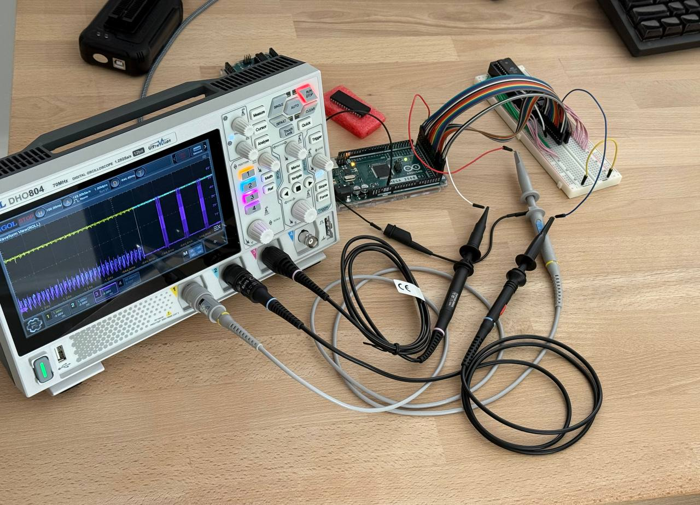

I connected an oscilloscope to the EEPROM to observe voltage behavior on the chip pins during a board reset:
* *yellow* probe monitors the 5 V power line. It is connected to the VCC input and supplies power to the chip;
* *blue* probe is attached to the !WE management pin, which controls the write operation;
* *purple* probe is connected to one of the address bus pins.

The probe impedance was pre-calibrated using the built-in signal generator, so the measurements should be reasonably accurate without significant error.

Reset Cycle Noise, 500 ms/div 👇
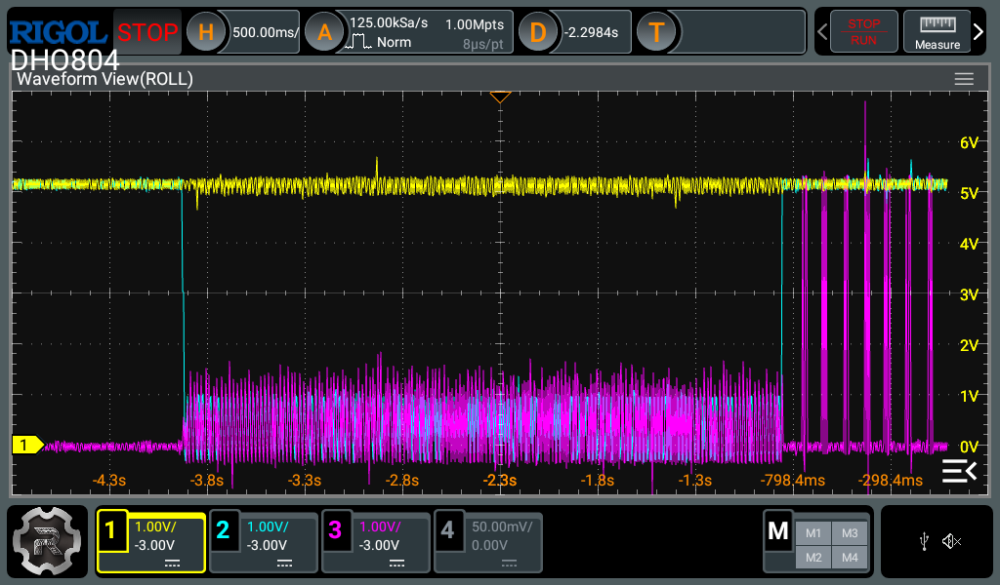

The full reset cycle lasts about 3 seconds. During this time, the 5 V supply line (yellow trace) remains stable, indicating that the chip is powered and responding to incoming pin signals. Meanwhile, the `!WC` pin, the data pin, and in fact all other chip pins, exhibit noise with voltage fluctuations of up to 2 V in amplitude.

Reset Cycle Noise, 100 ms/div 👇
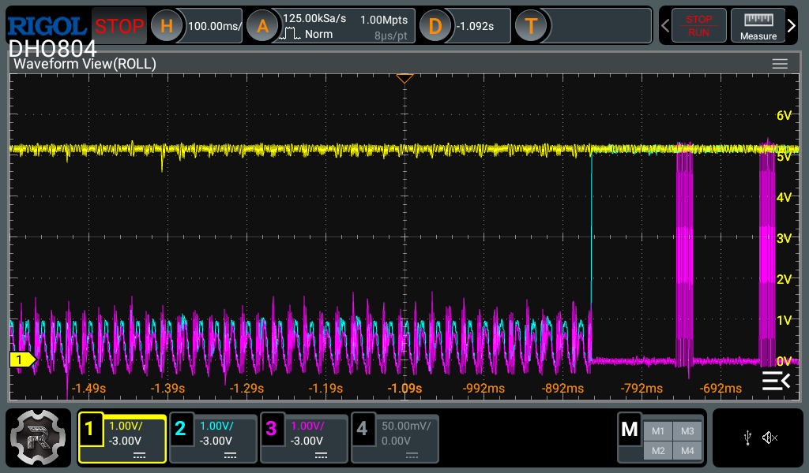

The spikes on the pins are relatively slow. In the graph above, each bar on the right represents a 64-bit page write sequence. As a result, the EEPROM chip has enough time to respond to these random transitions and write rubbish data into random memory cells.

Reset Cycle Noise, 5 ms/div 👇
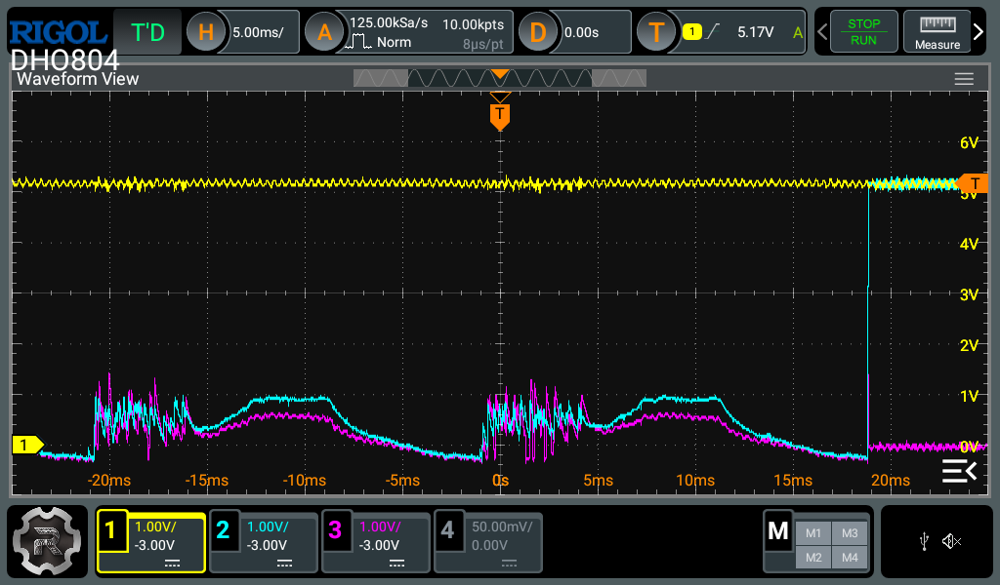

One reset oscillation cycle on the Arduino Mega lasts about 20 ms and consists of a phase of chaotic noise followed by a sinusoid-like segment. The sinusoidal amplitude is approximately 1 V.

Reset Cycle Noise, 1 ms/div 👇
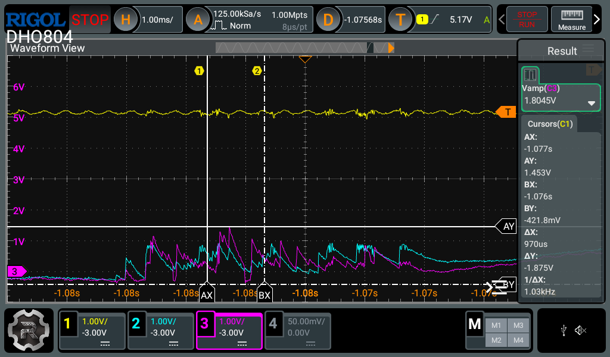

The amplitude of the chaotic noise phase can reach up to 2 V. In the chart above, the purple trace peaks at 1.8 V. In this specific case, it represents fluctuations on the data bus, but the distribution is random, so similar oscillations may also appear on the control pins.

Reset Cycle Noise, Warmed-Up System, 5 ms/div 👇
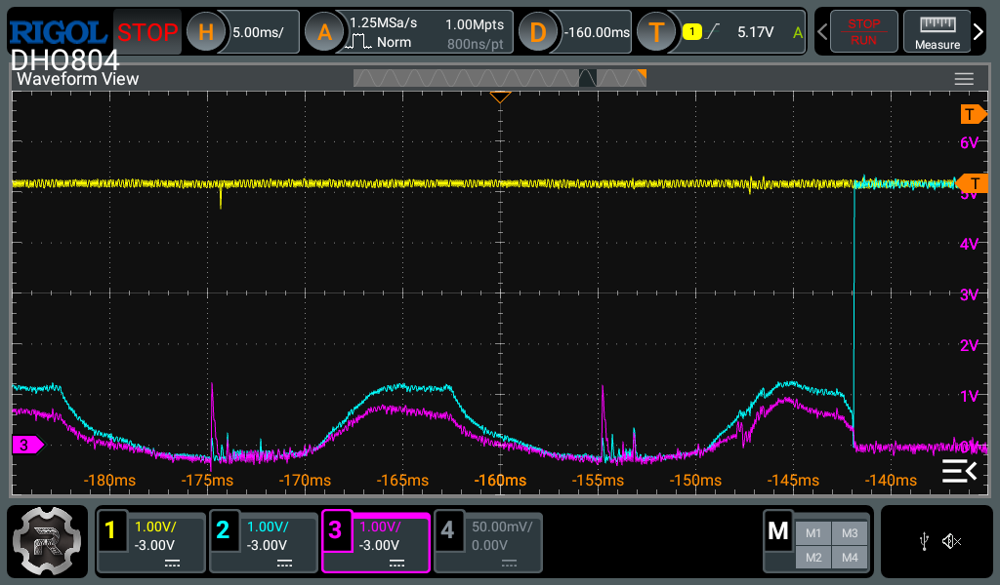

It’s worth noting that data corruption does not occur on a warmed-up system that has been running for more than an hour. The oscilloscope also fails to capture the chaotic noise phase responsible for corruption. A portion of the sinusoidal signal remains, but since its amplitude stays around 1.5 V, it does not cause random data corruption.

Reset Cycle Noise, Warmed-Up System, 1 ms/div 👇
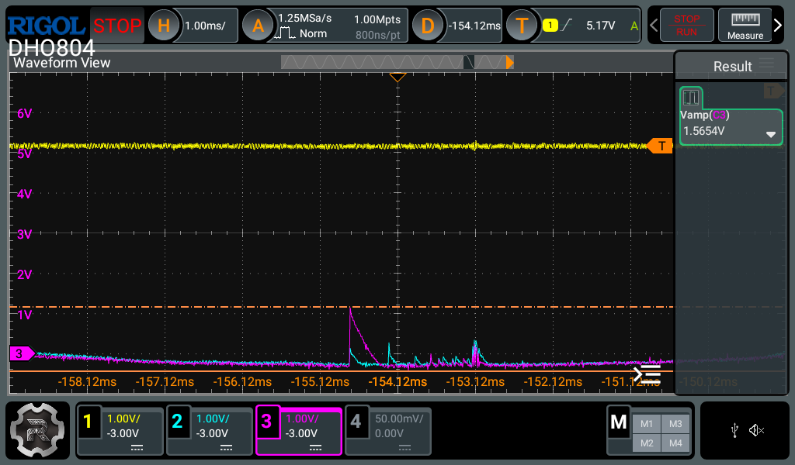

A small amount of noise remains, but it is negligible compared to the noise observed immediately after startup on a cold system.


## AT28C64 [Datasheet](https://ww1.microchip.com/downloads/en/devicedoc/doc0001h.pdf)

`!WE` activates on LOW signal
Input Low Voltage = 0.8 V max
Input High Voltage = 2.0 V min

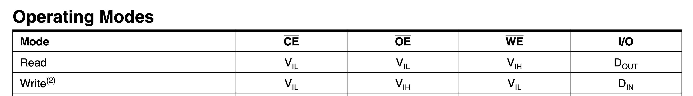

The Operating Modes table in the EEPROM datasheet shows that the chip uses different voltage levels for read and write modes. The table defines these levels as V Input High and V Input Low, which correspond to the `HIGH` and `LOW` states on the respective waveforms.

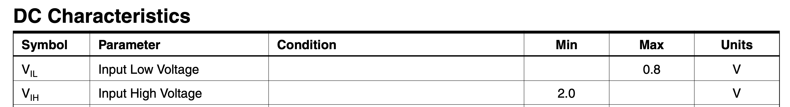

The next table, DC Characteristics, defines the maximum and minimum voltage thresholds for these levels. It shows that 2 V is the minimum voltage required for a `HIGH` state.

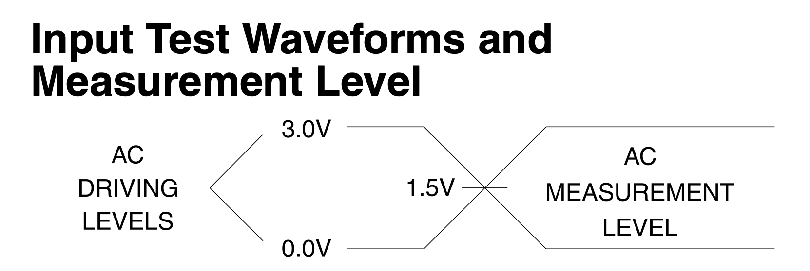

This part is somewhat contradictory, since `HIGH` and `LOW` levels are typically defined relative to `VCC` with some tolerance. In this case, `VCC` is 5 V and remains stable during the board reset. Therefore, fluctuations up to 2 V should not normally be interpreted by the chip as transitions between `HIGH` and `LOW` states on the management pins. However, the observed data corruption indicates otherwise.


## Data Corruption Examples


Do not use a chip containing important data for this experiment, as the data will be erased during the process.


In practice, the Arduino corrupts the chip data before reading it, by sending noisy signals to all chip pins.

To reproduce data corruption, perform the following steps:

(*) Details on connecting the EEPROM chip to the Arduino and setting up the environment to run the CLI are available in the [EEPROM Programmer](https://github.com/inn-goose/eeprom-programmer) project repository.

1. Completely erase the chip contents using the `--erase` command:

```bash
./eeprom_programmer_cli/cli.py /dev/cu.usbmodem2101 -p AT28C64 --erase
```

2. Read the contents of the erased chip using the `--read` command:

```bash
./eeprom_programmer_cli/cli.py /dev/cu.usbmodem2101 -p AT28C64 --read tmp/dump_eeprom.bin
```

3. Inspect the corrupted data using the `xxd` utility:

```bash
xxd tmp/dump_eeprom.bin > tmp/dump_eeprom.hex
```

```bash
cat tmp/dump_eeprom.hex
...
00000000: e0f8 f8ff f8ff f8ff ffff ffff ffff ffff  ................
...
00000020: ffff f8ff ffff f8ff ffff ffff ffff ffff  ................
...
00000400: f0ff f8ff ffff f800 ffff ffff ffff ffff  ................
00000410: f0ff ffff ffff ffff ffff ffff ffff ffff  ................
00000420: f0ff ffff ffff f8ff ffff ffff ffff ffff  ................
...
```

Random data regions are corrupted. Each new read produces a different result. The more times the data is read without the jumper wire, the more memory cells become corrupted.


## Solution

This issue requires a hardware solution. Before powering the Arduino to read the chip, a jumper wire must be placed between the `!WE` and `VCC` pins to drive the `!WE` pin `HIGH` and disable data writes.

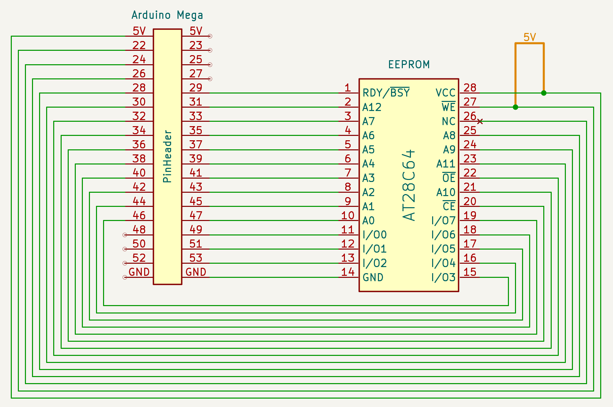

When reading data with the jumper wire connected, no corruption occurs. For write and erase operations, the jumper must be removed. Data remains intact if the Arduino is powered off immediately after a write operation, since no reset takes place and no random data is written.

I described the read and write results using the jumper wire in the [Implementing Serial JSON-RPC API](/blog/eeprom-programmer-4-serial-json-rpc-api/#eeprom-programmer-vs-xgecu-programmer) post. The data is written and read correctly, matching the reference results from the XGecu programmer.
