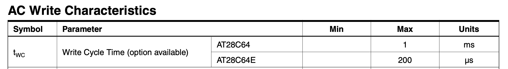
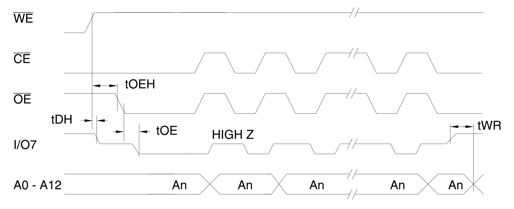
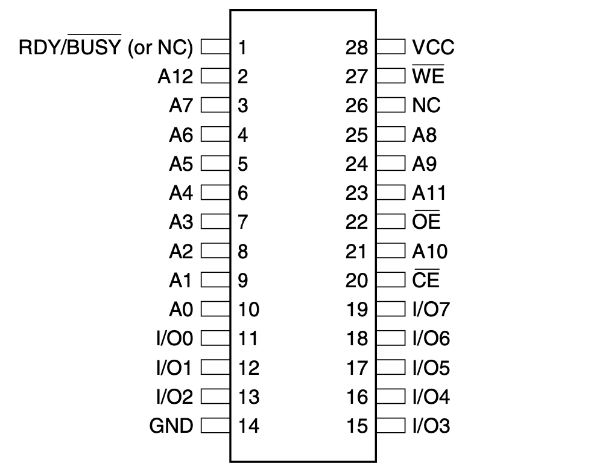
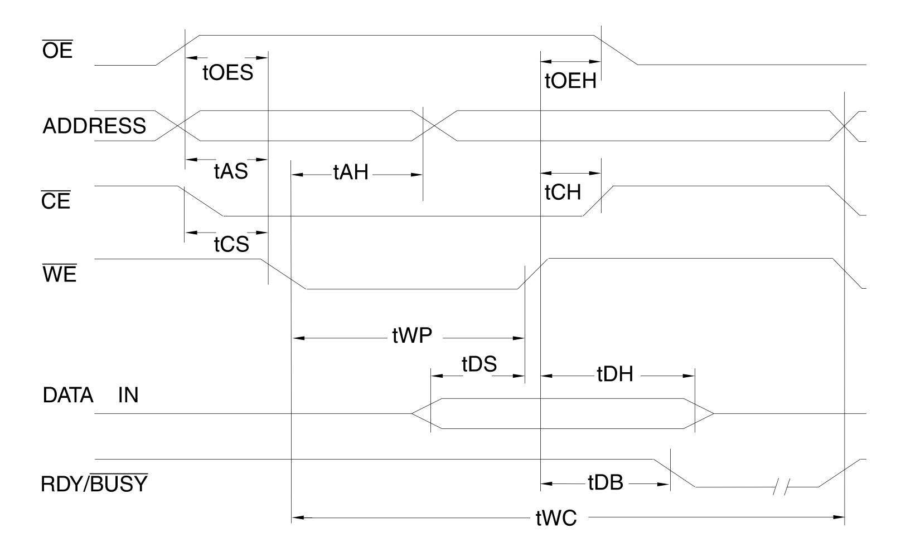
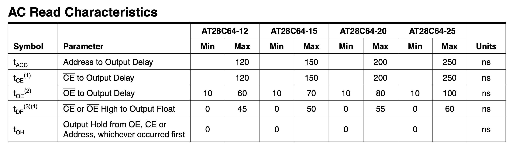

## TLDR

A single-bit write operation takes roughly 10 times longer than a read operation. The write routine must ensure that the data has been successfully written to memory before starting a new write cycle.

The datasheet describes two methods for verifying successful write completion, which allow starting the next cycle without waiting for the maximum threshold: **RDY/!BUSY pin polling** and **DATA polling**.

In this post, I will demonstrate how to implement the waveform for these operations in Arduino code and discuss the limitations I encountered during implementation.

## Max Write Time Delay

According to the [AT28C64 datasheet](https://ww1.microchip.com/downloads/en/devicedoc/doc0001h.pdf), a write cycle should take about 1 ms, but my measurements show it can take up to 1.4 ms in extreme cases. Most operations, however, complete in around 400 µs.

The simplest and slowest approach is to wait for the worst-case write time. This requires no waveform implementation. A single call like `delayMicroseconds(1.4 * 1000)` is sufficient.

This fallback remains valid, for example, if the `!BUSY` pin never transitions `LOW` to indicate the start of the internal write. In that case `!BUSY` pin polling does not work and the code must wait for the maximum write-time threshold.

Additionally, the polling routines themselves must not run indefinitely. They should be aborted once the maximum write wait-time threshold is reached.

## DATA Polling

The DATA polling operation is supported by all AT28C family devices and is simple to implement since it reuses the existing write logic.

> DATA POLLING: The AT28C64 provides DATA Polling to signal the completion of a write cycle. During a write cycle, an attempted read of the data being written results in the complement of that data for I/O7 (the other outputs are indeterminate). When the write cycle is finished, true data appears on all outputs.

The waveform for this operation is straightforward and includes the following steps:
1. Enable read mode on the management pins.
2. Read the data from the DATA bus.
3. Enable read mode on the management pins again.
4. Compare the read value with the data intended for writing.
5. If the values match, the write operation has completed successfully and the polling loop can be terminated early.
6. If not, repeat the sequence starting from step 1.

A large number of pin state transitions and digital reads takes about 250 µs on an Arduino Mega. As a result, a typical write operation completes within two polling cycles. By the second cycle, the correct data already appears on the bus and the loop terminates. For verification, I used dedicated EEPROM Programmer debug commands: `get_write_op_wait_time_usec()` and `get_write_op_wait_cycles()`. These commands showed consistent results: an average duration of about 450 µs and a total of 2 polling cycles.

## RDY/!BUSY Pin Polling

On one hand, this solution is more elegant and far less resource intensive, since it only needs to sample a single pin every 50 µs.

On the other hand, it is only supported by the **AT28C64**, because its package has more pins than the address bus width, leaving one `NC` (pin 26) and one assigned to `RDY/!BUSY` (pin 1). Additionally, the `RDY/!BUSY` pin can be left `NC` too and the DATA polling method can be used instead. Therefore, implementing this logic remains optional.

On the **AT28C256**, both of those pins are taken by the address bus, so the method is not supported. On the **AT28C16**, the package is DIP-24 despite the “28” in the name, and all pins are also used by the address bus.

> READY/BUSY: Pin 1 is an open drain RDY/BUSY output that can be used to detect the end of a write cycle. RDY/BUSY is actively pulled low during the write cycle and is released at the completion of the write. The open drain connection allows for OR-tying of several devices to the same RDY/BUSY line.

The waveform for this operation is part of the overall write sequence and illustrates simple logic:
1. When a write operation starts, the pin goes to the `!BUSY` or `LOW` state.
2. When the write completes, the pin transitions to the `RDY` or `HIGH` state.
3. As soon as the pin returns to `HIGH` state, the polling loop can be terminated early.
4. If not, repeat the sequence starting from step 1.

As seen, this method is simpler and lighter than **DATA polling**. The total wait time is similar—around 400–450 µs, with about 4–5 polling attempts, assuming a 100 µs delay between checks.

## Summary

The logic described here is based on the AT28C64, but the implementation applies to the entire AT28C family. Since both polling methods produce identical write times, the specific implementation choice is largely irrelevant and provides no performance advantage.

Arduino allows implementing both polling procedures without any logical limitations. The only constraint comes from the Arduino library, which sets the minimum delay for `delayMicroseconds()` at 1 µs, while a read operation completes within roughly 100 ns. However, this limitation is negligible for write operations, since a typical write takes around 400 µs.

With either polling method, the overall wait time is reduced by roughly a factor of three compared to the fixed threshold delay. Therefore, implementing one of these procedures is recommended, as the added complexity is moderate.

However, the overall write time using the EEPROM Programmer and Arduino Mega remains relatively long compared to the XGecu. Using an Arduino Giga can improve both write and read performance, since the bottleneck lies not in the EEPROM chip itself but in the Arduino’s processing speed.
