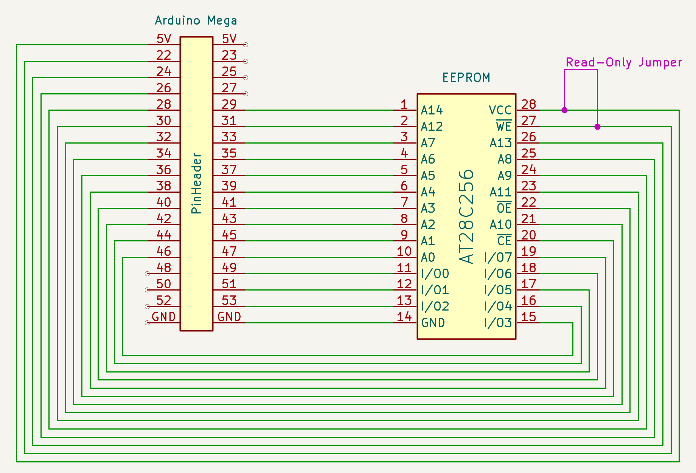
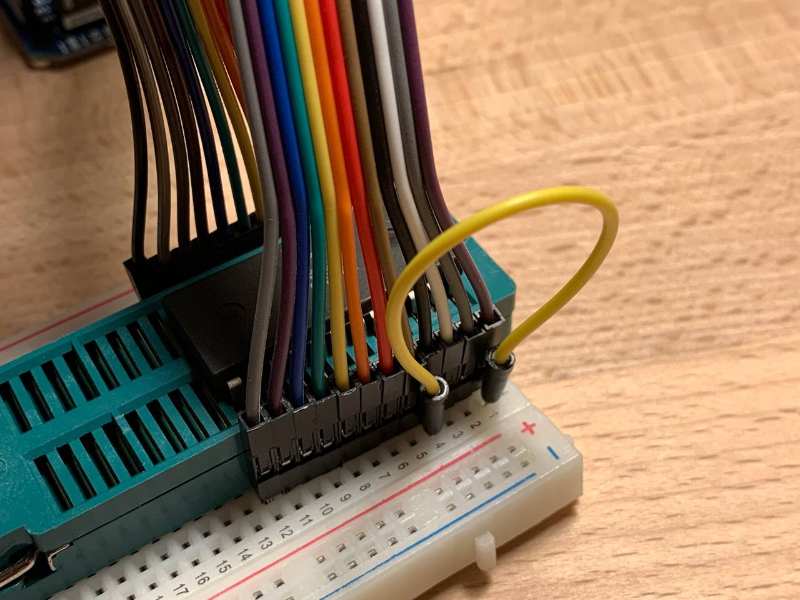
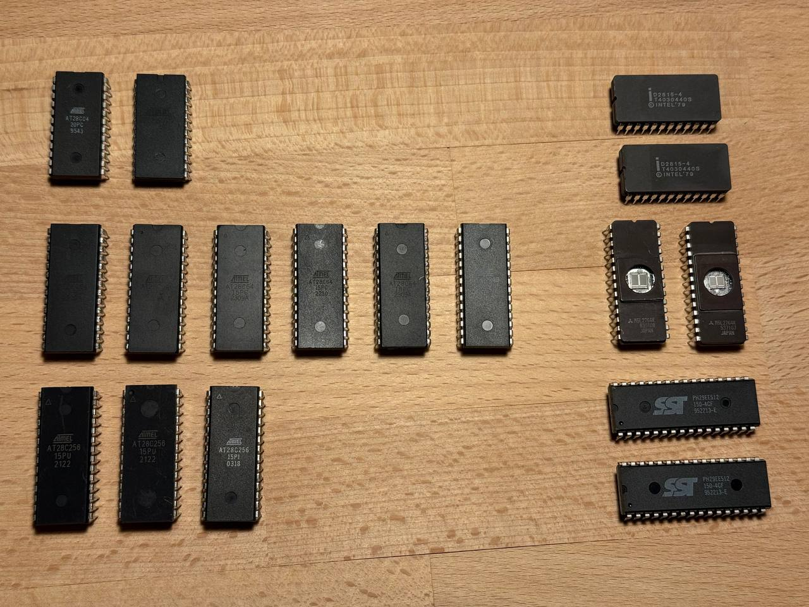


During read operations with the EEPROM Programmer, the chip's `!WE` pin **MUST** be connected to `VCC` using a jumper wire to disable the write mode. Otherwise, invoking the CLI may corrupt data on the chip due to Arduino's internal behavior. [Details](/blog/eeprom-programmer-5-data-corruption/)


## TLDR

[EEPROM Programmer on GitHub](https://github.com/inn-goose/eeprom-programmer)

In this post, the work on the EEPROM Programmer project is brought to a close. It describes how to configure and connect an EEPROM chip to an Arduino, and how to avoid data corruption during read operations. In addition, performance measurements across different Arduino platforms are presented, and the page-write mode is discussed, including why it is not always feasible.

At this point, the programmer supports all chip types from the AT28Cxx family that were available for purchase: AT28C04, AT28C16, AT28C64, and AT28C256. In some cases, chip-specific features are utilized—such as `RDY/!BUSY` polling or page-write mode, which significantly accelerate the write process.

The project assumes the use of Arduino platforms with an extended number of I/O pins, specifically the MEGA or DUE. An attempt to run the project on the GIGA platform was unsuccessful due to platform-specific constraints and issues with the Serial interface.

At the end of the post, a list of chips is provided for which support was planned but could not be implemented due to hardware-specific constraints. Requests for additional chip support can be submitted via the repository [discussion section](https://github.com/inn-goose/eeprom-programmer/discussions), or proposed directly through a pull request.

It should be noted that both read and write speeds are orders of magnitude lower than when using dedicated commercial programmers such as XGecu.


## How to Connect

EEPROM Programmer supports two different chip layouts: DIP24 and DIP28. Switching between these modes requires recompilation and reflashing of the firmware on the microcontroller.

file: `./eeprom_programmer/eeprom_programmer.ino`
```
// EEPROM Programmer

// specify the wiring type here
// * DIP24
// * DIP28
static EepromProgrammer eeprom_programmer(BoardWiringType::DIP24);
// static EepromProgrammer eeprom_programmer(BoardWiringType::DIP28);
```

The connection process is intentionally simplified and predefined for using a breadboard-mounted chip via two ribbon cables connected to the Arduino’s extended pin headers. One ribbon cable supplies VCC to the chip, while the other connects GND.


The appropriate DIP24 or DIP28 layout should be selected depending on the chip type. Despite the “28” designation in the family name, the 4 KB and 16 KB chips use the DIP24 layout.




[Data Corruption on Arduino Serial Connection Reset](/blog/eeprom-programmer-5-data-corruption/) post describes Arduino hardware characteristics and explains why an Read-Only Jumper wire must be used during read operations to avoid data corruption. In both the wiring diagrams (purple) and the photographs (yellow), the jumper wire position is indicated for both DIP24 and DIP28 chips.




In the experiments, a ZIF socket and ribbon cables are used for convenience. This is not a strict requirement: the chip can be connected on a breadboard using standard wires and inserted directly into the breadboard. The use of a ZIF socket is justified in scenarios that require frequent reprogramming, such as development of an 8-bit or 16-bit breadboard computer.


## XGecu Performance as a Reference

The XGecu hardware programmer was used as a reference during development to verify the correctness of written and read data. In this post, the hardware programmer is also used as a baseline for performance comparison.

Below is the list of commands required to program and verify data using XGecu. For 4K and 16K chips, a dedicated `@DIP24` suffix is required. The same test data is used as for evaluating the performance of the EEPROM Programmer. These short stories about the adventures of geese in space were written by AI.

```
# AT28C04
minipro --device AT28C04@DIP24 -s -u --write test_bin/4_journey_of_luna_AT28C04_ff.bin

# AT28C16
minipro --device AT28C16@DIP24 -s -u --write test_bin/16_geese_in_space_AT28C16_ff.bin

# AT28C64
minipro --device AT28C64 -s -u --write test_bin/64_the_red_migration_AT28C64_ff.bin

# AT28C256
minipro --device AT28C256 -s -u --write test_bin/256_the_geometry_of_flight_AT28C256_ff.bin
```

| Chip | Size | Full Memory Read (sec) | Full Memory Write (sec) |
| -- | :--: | :--: | :--: |
| AT28C04 | 512 x 8 | 0.00 | 0.53 |
| AT28C16 | 2K x 8 | 0.01 | 2.10 |
| AT28C64 | 8K x 8 | 0.06 | 8.46 |
| AT28C256 | 32K x 8 | 0.28 | 5.56 |

Note that the write time for the 256K chip is nearly half that of the 64K chip, since the 256K chip supports page-write mode with the use of an internal cache, which significantly accelerates the process. The same approach is implemented in the EEPROM Programmer and is demonstrated later in the post. Read speed increases linearly, as no specialized mechanisms for accelerating read operations are employed.


## EEPROM Programmer Performance

Once again, it is important to emphasize that the RO jumper must be removed during write operations and installed during read operations in order to prevent errors caused by data corruption.

```
# AT28C04
./eeprom_programmer_cli/cli.py /dev/cu.usbmodem2101 -p AT28C04 --write test_bin/4_journey_of_luna_AT28C04_ff.bin --skip-erase --collect-performance
./eeprom_programmer_cli/cli.py /dev/cu.usbmodem2101 -p AT28C04 --verify test_bin/4_journey_of_luna_AT28C04_ff.bin --collect-performance

# AT28C16
./eeprom_programmer_cli/cli.py /dev/cu.usbmodem2101 -p AT28C16 --write test_bin/16_geese_in_space_AT28C16_ff.bin --skip-erase --collect-performance
./eeprom_programmer_cli/cli.py /dev/cu.usbmodem2101 -p AT28C16 --verify test_bin/16_geese_in_space_AT28C16_ff.bin --collect-performance

# AT28C64
./eeprom_programmer_cli/cli.py /dev/cu.usbmodem2101 -p AT28C64 --write test_bin/64_the_red_migration_AT28C64_ff.bin --skip-erase --collect-performance
./eeprom_programmer_cli/cli.py /dev/cu.usbmodem2101 -p AT28C64 --verify test_bin/64_the_red_migration_AT28C64_ff.bin --collect-performance

# AT28C256
./eeprom_programmer_cli/cli.py /dev/cu.usbmodem2101 -p AT28C256 --write test_bin/256_the_geometry_of_flight_AT28C256_ff.bin --skip-erase --collect-performance
./eeprom_programmer_cli/cli.py /dev/cu.usbmodem2101 -p AT28C256 --verify test_bin/256_the_geometry_of_flight_AT28C256_ff.bin --collect-performance
```

Performance and support for page-write functionality are highly dependent on the microcontroller model. Arduino MEGA operates at 16 MHz, whereas DUE runs at 84 MHz, which is more than five times higher. [Arduino Pin Toggle Performance](/blog/experiments-1-arduino-performance/) post depicts how microcontroller clock frequency affects pin state switching speed, which directly underpins read and write procedures. As a result, read and write throughput scales linearly with microcontroller frequency, subject to overhead and the intrinsic limitations of the EEPROM chip.

For example, page-write mode is not feasible on Arduino MEGA because a single data write operation—consisting of setting the address lines, driving the data lines, and toggling the control pins—takes more than 400 µs. In contrast, the AT28C256 expects each byte to be written in less than 150 µs. With DUE's clock frequency being over five times higher, the same operation takes approximately 110 µs, which falls within the required timing window, making page-write mode viable on that platform.

It is worth noting separately that, despite the significant improvement in read performance when using DUE, write time in the standard byte-wise mode changes only marginally. This indicates internal limitations of the EEPROM chips rather than performance constraints of the Arduino platform itself. For example, the read time for the AT28C256 is reduced from approximately 490 µs to 125 µs, while the write time for a single byte remains on the order of 6000 µs. Meaningful write-speed improvements are achieved only through the use of page-write mode.

### Arduino MEGA, 16 MHz

| Chip | Size | Full Memory Read (sec) | Full Memory Write (sec) |
| -- | :--: | :--: | :--: |
| AT28C04 | 512 x 8 | 1.4 | 1.8 |
| AT28C16 | 2K x 8 | 5.5 | 14 |
| AT28C64 | 8K x 8 | 21 | 28 |
| AT28C256 | 32K x 8 | 84 | 305 |

### Arduino DUE, 84 MHz

| Chip | Size | Full Memory Read (sec) | Full Memory Write (sec) |
| -- | :--: | :--: | :--: |
| AT28C04 | 512 x 8 | 0.9 | 1.4 |
| AT28C16 | 2K x 8 | 3.6 | 11 |
| AT28C64 | 8K x 8 | 15 | 22 |
| AT28C256 | 32K x 8 | 56 | 85/255* |

(*) AT28C256 Write time in page mode and byte-mode; page mode is 3 times faster


## Supported EEPROM Chips in Details


### AT28C04 @ DIP24

[AT28C04 Datasheet](https://www.tvsat.com.pl/pdf/A/at28c04_atm.pdf)

This is the smallest and fastest chip in the AT28Cxx lineup. The reason is unclear, but the write time for a single byte on this chip is approximately four times faster than on the 16K chip. This is most likely also related to the smaller memory size of the chip itself.

The chip has two `NC` pins, which are configured as `INPUT_PULLUP` by default. Observations related to connecting NC pins are described in [How to Initialize NC Chip Pins](/blog/experiments-2-misconfigured-arduino-pins/#how-to-initialize-nc-chip-pins) post.

The chip is packaged in a DIP24 form factor, despite the “28” designation in its name.

| Arduino | 1B Read AVG (µs) | Full Memory Read (sec) | 1B Write AVG (µs) | Full Memory Write (sec) |
| -- | :--: | :--: | :--: | :--: |
| Mega, 16 MHz | 450 | 1.4 | 950 | 1.8 |
| Due, 84 MHz | 120 | 0.9 | 600 | 1.4 |

The total time required to program the entire chip does not correlate directly with the time to 1B write, due to overhead from the JSON-based Serial protocol and measurement inaccuracies, as the per-byte write time is calculated as an AVG.

### AT28C16 @ DIP24

[AT28C16 Datasheet](http://cva.stanford.edu/classes/cs99s/datasheets/at28c16.pdf)

This is a fairly popular chip among enthusiasts. It is commonly recommended as a replacement for the AT28C04, although it is approximately four times slower in write operations. Read performance is identical for both chips. This chip also uses a DIP24 package, like the 4K variant, and all pins are utilized to provide 11 address bits on the address bus.

| Arduino | 1B Read AVG (µs) | Full Memory Read (sec) | 1B Write AVG (µs) | Full Memory Write (sec) |
| -- | :--: | :--: | :--: | :--: |
| Mega, 16 MHz | 450 | 5.5 | 3800 | 14 |
| Due, 84 MHz | 120 | 3.6 | 3400 | 11 |

### AT28C64 @ DIP28

[AT28C64 Datasheet](https://ww1.microchip.com/downloads/en/devicedoc/doc0001H.pdf)

This is the favorite chip in the lineup, as it supports a dedicated `RDY/!BUSY` pin polling feature. Implementing this mechanism in code was particularly interesting, and it is significantly faster and more efficient than the data polling approach. However, it requires an additional pin, which is a relatively costly trade-off.

Implementation details of this mechanism are described in [Using Data Polling vs RDY/!BUSY Pin for Write Operations](/blog/eeprom-programmer-6-data-polling-vs-rdy-busy/) post.

Apparently, the use of the `RDY/!BUSY` mechanism reduces the write time from approximately 3800 µs on the 16K chip to about 850 µs on the 64K chip.

| Arduino | 1B Read AVG (µs) | Full Memory Read (sec) | 1B Write AVG (µs) | Full Memory Write (sec) |
| -- | :--: | :--: | :--: | :--: |
| Mega, 16 MHz | 420 | 21 | 850 | 28 |
| Due, 84 MHz | 120 | 15 | 640 | 22 |


### AT28C256 @ DIP28

[AT28C256 Datasheet](https://ww1.microchip.com/downloads/en/DeviceDoc/doc0006.pdf)

This chip introduces page-write support, which uses a 64-byte internal cache and significantly accelerates programming of the entire memory. This functionality is vital for larger-capacity chips: byte-wise programming on Arduino DUE takes on the order of five minutes, whereas page-write mode reduces this to just over one minute.

However, implementing this mechanism on Arduino MEGA is not feasible. Due to the microcontroller’s clock frequency, the combined sequence of driving the address bus and data bus exceeds 400 µs, while the datasheet specifies a maximum of 150 µs for this operation. On DUE, the same sequence takes approximately 110 µs, which makes page-write mode viable on that platform.

Implementation details of the page-write mode are described in the [AT28C256's Page Write Operation](/blog/eeprom-programmer-7-page-write/) post.

file: `./eeprom_programmer/eeprom_programmer_lib.h`
```
    case ChipType::AT28C256:
      // doesn't work on Arduino MEGA
      // enable if use Arduino DUE only
      _can_write_pages = true;
      break;
```

| Arduino | 1B Read AVG (µs) | Full Memory Read (sec) | 1B Write AVG (µs) | Full Memory Write (sec) |
| -- | :--: | :--: | :--: | :--: | :--: |
| MEGA, 16 MHz | 490 | 84 | 6400 | 305 |
| DUE, 84 MHz | 125 | 56 | 210/6000* | 85/255* |

(*) AT28C256 Write time in page mode and byte-mode; page mode is 3 times faster for chip and 30 times faster for byte


## Not Supported Chips

* [Mitsubishi M5L2764K](http://product.ic114.com/PDF/M/M5L2764K.PDF)
* [Intel D2815-4](https://www.ebay.co.uk/itm/225089489343)
* [SST 29EE512](https://www.alldatasheet.com/datasheet-pdf/view/191598/SST/SST29EE512.html)

There are several chips that could not be programmed using the existing logic. The Intel D2815-4 could be read successfully, but write operations did not work. In addition, a datasheet for this chip could not be located. The SST 29EE512, on the other hand, uses a DIP32 package, which is not supported by the current hardware layout.
If support for these chips is of interest, leave a comment in the [discussion section](https://github.com/inn-goose/eeprom-programmer/discussions) of the [EEPROM Programmer on GitHub](https://github.com/inn-goose/eeprom-programmer), and this will be investigated further.


