## TLDR

In this post, I summarize my observations of incorrect Arduino behavior made during debugging of the [EEPROM API for Arduino]((https://github.com/inn-goose/eeprom-api-arduino)) project. The related post, [Debugging the EEPROM API]((https://goose.sh/blog/debugging-eeprom-api/)), describes the debugging process and the sequence of steps that led to identifying the root cause.

I connect external chips such as CPUs or EEPROMs directly to the Arduino and exchange digital signals with them. The resulting signal often resembles PWM, where the oscilloscope waveform appears as a series of narrow pulses. Complex chips expect this kind of pulsed signaling and can respond unpredictably to any other form of data exchange.

Improperly initialized Arduino pins distort the transmitted signal and can cause data corruption if the connected chip supports memory read and write operations. In this post, I present several examples of distorted data transmission and demonstrate how to quickly identify the problem using an oscilloscope. At the end, I explain how to properly connect the NC (Not Connected) pins of the chip to prevent parasitic noise from the Arduino from affecting the chip’s correct operation.


For the experiments, I used an oscilloscope with a single probe connected and an Arduino Uno R3 board. The post includes code examples, explanations of correct and incorrect behavior, and oscilloscope waveform screenshots for clarity.

Separately from the experiments, I analyze what happens during an Arduino reset, which signals appear on the pins and how they can affect externally connected chips.


## "Initialized" and "Uninitialized" Pins Experiments

I use a simple PWM signal loop to simulate digital data transmission. The experiment includes three tests with different signal switching speeds.
In the first case, the pin mode is correctly configured in Arduino's `setup()` function, and the oscilloscope shows the expected result: clean voltage pulses switching between 0 V and 5 V, with only the frequency changing. In the second case, no mode is set for the pin, leaving it in an undefined state. In this configuration, the pin behaves unpredictably, with the output pattern varying depending on the frequency.

Additionally, I test how the pin behaves in a static `HIGH` or `LOW` signal. When the pin is properly initialized, it outputs a stable voltage level of 0 V or 5 V. However, if the pin is uninitialized, its behavior again becomes unpredictable.


### PWM Signal Loop

```cpp
void setup() {
    // comment this line for the "uninitialized" experiment
    pinMode(13, OUTPUT);
}

void loop() {
    // low frequency, 10 ms
    // const int delay_us = 10000;

    // medium frequency, 1 ms
    // const int delay_us = 1000;

    // high frequency, 0.1 ms
    const int delay_us = 100;

    // PWM waveform
    delayMicroseconds(delay_us / 2);
    digitalWrite(13, 1);
    delayMicroseconds(delay_us / 2);
    digitalWrite(13, 0);
}
```

#### Initialized Pins

When a pin is properly initialized, the PWM output produces uniform, clean pulses at any frequency. The durations of the 0 V and 5 V levels are consistent, forming flat, stable plateaus. This is how a correct digital signal should look. Below are oscilloscope waveform screenshots taken at different PWM frequencies and time/div scales for clarity.

Initialized Low Frequency PWM, 10 ms/div 👇


Initialized Medium Frequency PWM, 10 ms/div 👇
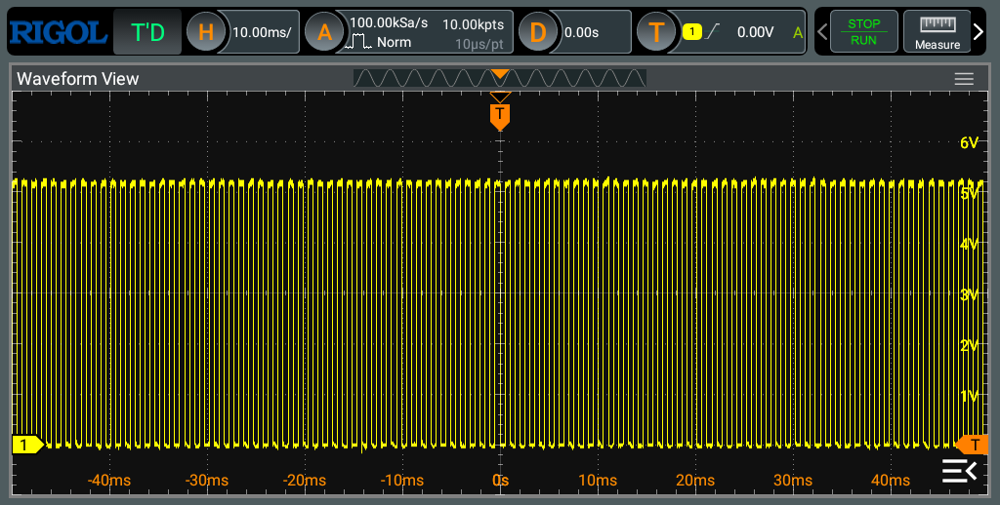

Initialized Medium Frequency PWM, 1 ms/div 👇
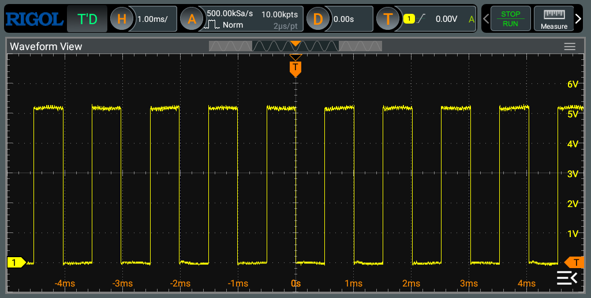

Initialized High Frequency PWM, 1 ms/div 👇


Initialized High Frequency PWM, 0.1 ms/div 👇


#### Uninitialized Pins

Uninitialized pins behave differently at various frequencies. The higher the frequency, the harder it is to recognize the original signal shape, and the lower the chance that an external chip—such as a CPU or DAC—can tolerate the distortion. A general pattern can be observed: the signal drifts, which becomes visible at larger time/div values. The upper part remains relatively stable around 5 V, while the lower part turns into a sine-like waveform and never reaches 0 V. As the modulation speed increases, the waveform becomes more compressed.

Uninitialized Low Frequency PWM, 100 ms/div 👇
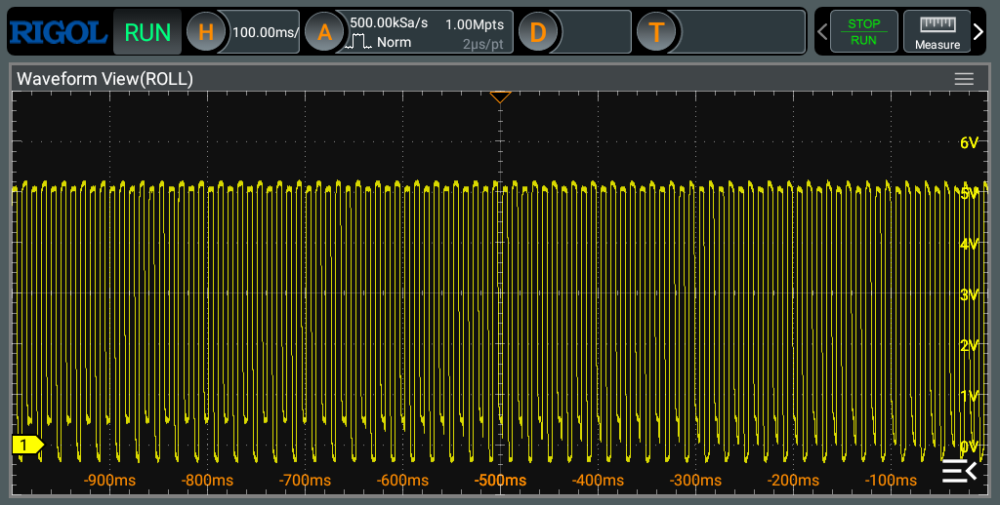

Uninitialized Low Frequency PWM, 10 ms/div 👇


At low frequencies, the digital nature of the signal is still somewhat recognizable, but the pattern is unstable. The lower edge is jagged, with full pulses alternating with shorter ones in a sinusoidal rhythm, clearly visible at 100 ms/div.

Uninitialized Medium Frequency PWM, 10 ms/div 👇


Uninitialized Medium Frequency PWM, 1 ms/div 👇
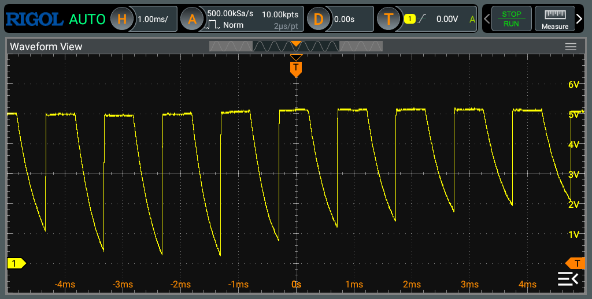

At medium frequencies, this effect becomes more pronounced. The plateau near 0 V disappears, giving the waveform a sawtooth shape. The drifting lower-edge pattern becomes clearer at 10 ms/div.

Uninitialized High Frequency PWM, 1 ms/div 👇
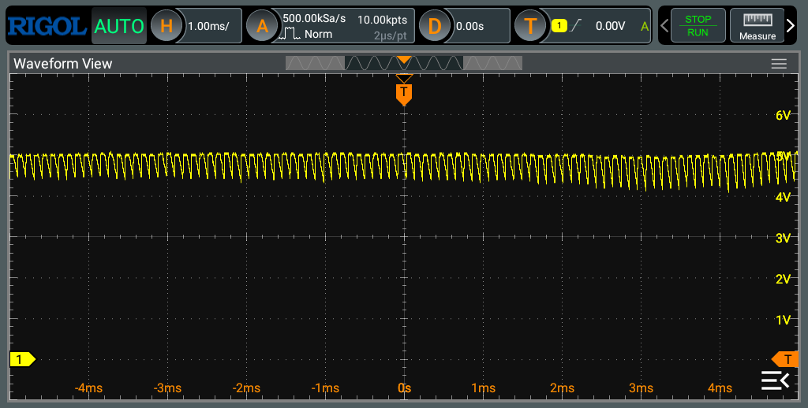

Uninitialized High Frequency PWM, 0.1 ms/div 👇


At high frequencies, the waveform turns into a sawtooth pattern near the 5 V level. The characteristic digital pulse pattern completely disappears. In this case, an external chip would interpret the signal as a constant HIGH at best, or as noise affecting the entire circuit at worst.

Note, that this is not a bandwidth limitation of the oscilloscope — waveform from a properly initialized pin at the same speed and scale shows a clean pulsed pattern, see the waveform example in the "Initialized Pins" section above.


### Stable `HIGH` or `LOW` Signal

```cpp
void setup() {
    // comment this line for the "uninitialized" experiment
    pinMode(13, OUTPUT);

    digitalWrite(13, HIGH);  // or LOW
}

void loop() {}
```

#### Initialized Pins

Properly initialized pins with stable values behave exactly as expected, outputting 5 V or 0 V depending on the digital signal applied to the pin—no surprises or deviations. When examined closely at low time/div values, small fluctuations within about 100 mV can be seen. These are likely background noise from the frequency generator. External digital devices are generally insensitive to this level of signal variation and do not interpret it as logic changes between 0 and 1.

Initialized HIGH signal, 50 ms/div 👇


Initialized HIGH signal, 10 ms/div 👇
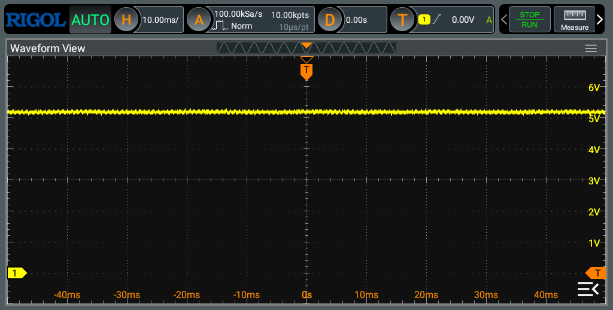

For an initialized pin, noise fluctuations are the same for both HIGH and LOW levels and remain within 50–100 mV, which is negligible at a 5 V signal scale.

Initialized LOW signal, 50 ms/div 👇
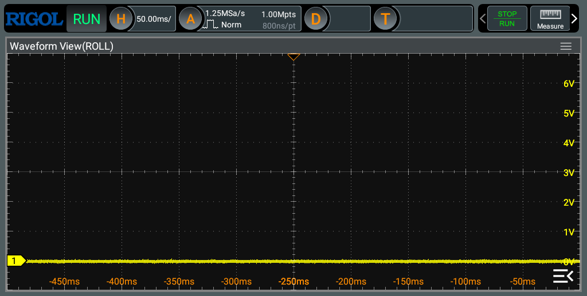

Initialized LOW signal, 10 ms/div 👇
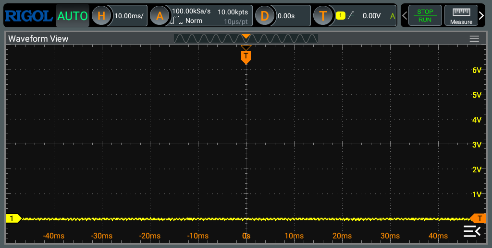

#### Uninitialized Pins

The behavior of uninitialized pins differs significantly between HIGH and LOW states.

Uninitialized HIGH signal, 50 ms/div 👇


Uninitialized HIGH signal, 10 ms/div 👇


When driven HIGH, the signal pattern becomes irregular and the amplitude of fluctuations increases, but it still remains within the 5 V range, with variations up to about 200 mV. External chips would still interpret this as a valid HIGH signal.

Uninitialized LOW signal, 50 ms/div 👇


Uninitialized LOW signal, 10 ms/div 👇


In the LOW state, the amplitude of fluctuations increases to about 1 V, while the same background noise pattern observed on initialized pins remains. Oscillations between 0 V and 1 V can be interpreted by an external chip as transitions between HIGH and LOW, potentially causing unpredictable behavior.

While the board outputs a stable LOW signal, an external device—such as a DAC—may interpret this noise as a sequence of 0–1 transitions and produce unintended output patterns or audible artifacts.

I analyze the behavior of an uninitialized pin in more detail in one of the following sections, explaining why a board reset can cause data corruption in a connected EEPROM chip.


## How to Initialize NC Chip Pins

Many integrated circuits include Non-Connected (NC) pins as part of their specification. For example, the AT28Cxx family of EEPROM chips shares the same package form factor across models with different memory sizes. In lower-capacity versions, the higher address bits are unused and are therefore marked as NC.

The same chip family defines different connection modes for different operating states. For example, the `!BSY` pin should remain NC during read operations, but during write operations it outputs a signal indicating the completion of the write cycle. In this case, the connection type for this pin must be controlled programmatically.

As discussed above, leaving such pins uninitialized can cause unpredictable and sometimes destructive behavior. The question is how to properly initialize an NC pin. Community guidance often suggests `INPUT_PULLUP`, I compare it with `OUTPUT` mode driven `LOW` and evaluate the chip’s behavior.

The following example is taken from the codebase of my [EEPROM API]((https://github.com/inn-goose/eeprom-api-arduino)) project.

```cpp
// INPUT_PULLUP
pinMode(_nonConnectedPins[i], INPUT_PULLUP);

// OUTPUT + LOW
pinMode(_nonConnectedPins[i], OUTPUT);
digitalWrite(_nonConnectedPins[i], LOW);
```

Uninitialized NC Pin 👇
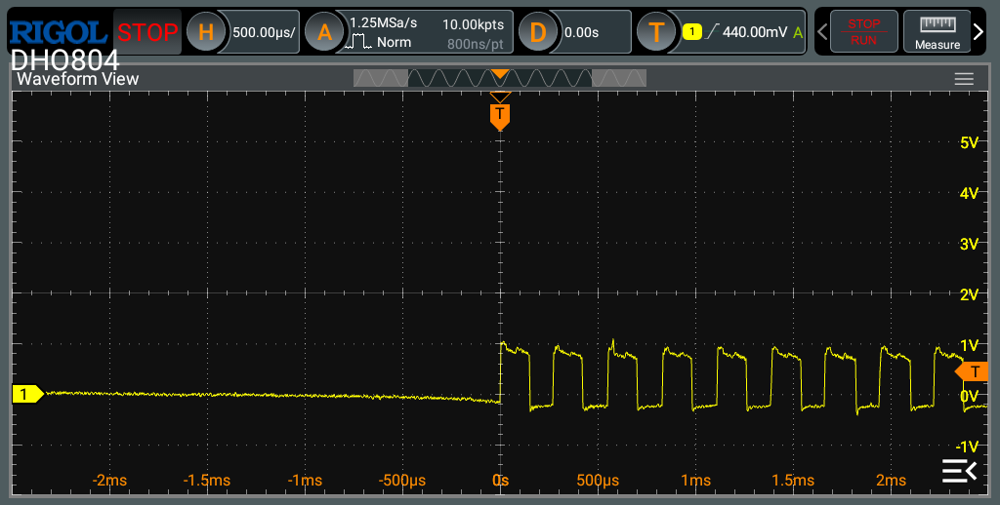

Potentially destructive behavior: an uninitialized pin picks up crosstalk from adjacent pins during read and write operations. The induced excursions are on the order of 1 V and match the toggling pattern of the neighboring address pin. It is unclear whether this unexpected signal on the NC pin affects device operation, but the behavior does not look safe.

INPUT_PULLUP NC Pin 👇


Using `INPUT_PULLUP` mode works, but it drives the NC pin `HIGH`, while many datasheets recommend tying NC pins to `GND`. I have not observed adverse behavior with `INPUT_PULLUP`; in fact, I migrated all EEPROM API interfaces to this scheme. It functions correctly, though the mismatch with the `GND` recommendation is counterintuitive.

Additionally, the waveforms show noise in the form of positive and negative spikes up to 1 V. This noise appears consistent with crosstalk from adjacent pins during device operation and, in pattern, resembles the noise observed on an uninitialized pin.

OUTPUT mode and LOW signal NC Pin 👇


Using the `OUTPUT` mode with a `LOW` signal produces the most predictable and consistent results. No crosstalk noise from adjacent pins is observed, and the NC pin is held at 0 V, effectively tied to `GND`, which aligns with the device specifications.


## How Arduino Behaves During the Reset

🚧 WIP 🚧

```cpp
void setup() {
  pinMode(11, OUTPUT);
  pinMode(12, OUTPUT);
  // 13 is a management one, use 10 for the non-management case
  pinMode(13, OUTPUT);
}

void loop() {
  const int delay_us = 12000;
  delayMicroseconds(delay_us / 6);
  digitalWrite(11, 1);
  delayMicroseconds(delay_us / 6);
  digitalWrite(12, 1);
  delayMicroseconds(delay_us / 6);
  digitalWrite(13, 1);  // or 10
  delayMicroseconds(delay_us / 6);
  digitalWrite(11, 0);
  delayMicroseconds(delay_us / 6);
  digitalWrite(12, 0);
  delayMicroseconds(delay_us / 6);
  digitalWrite(13, 0);  // or 10
}
```


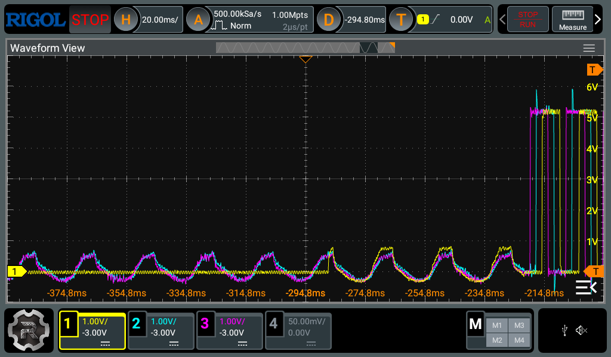
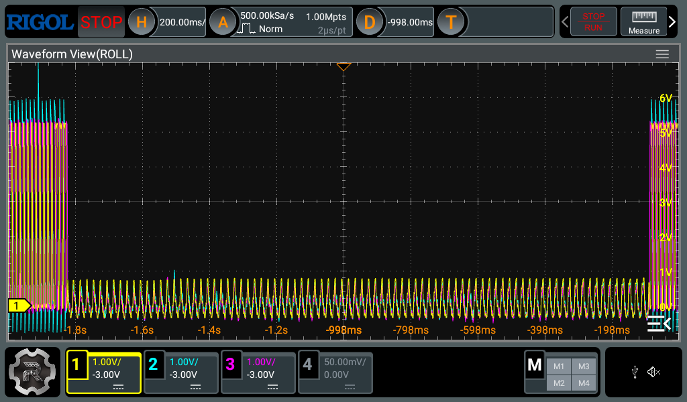
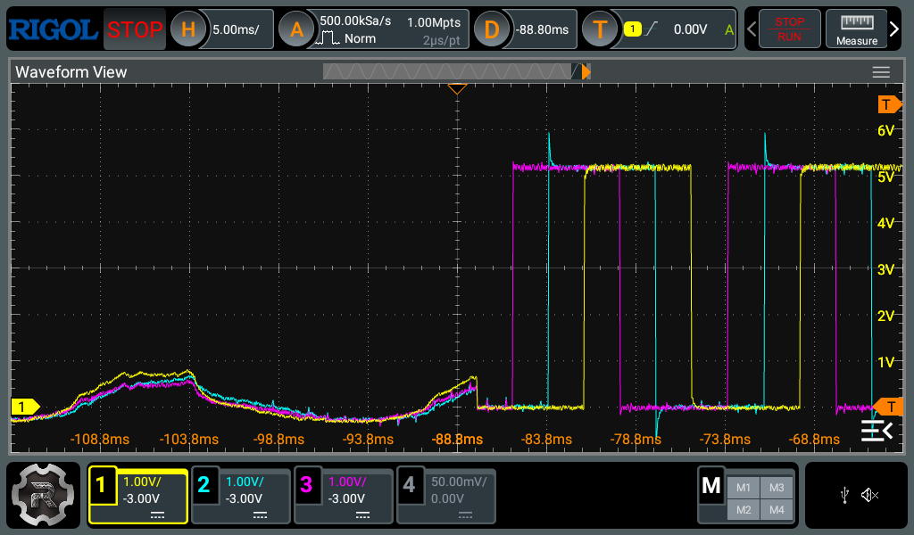
