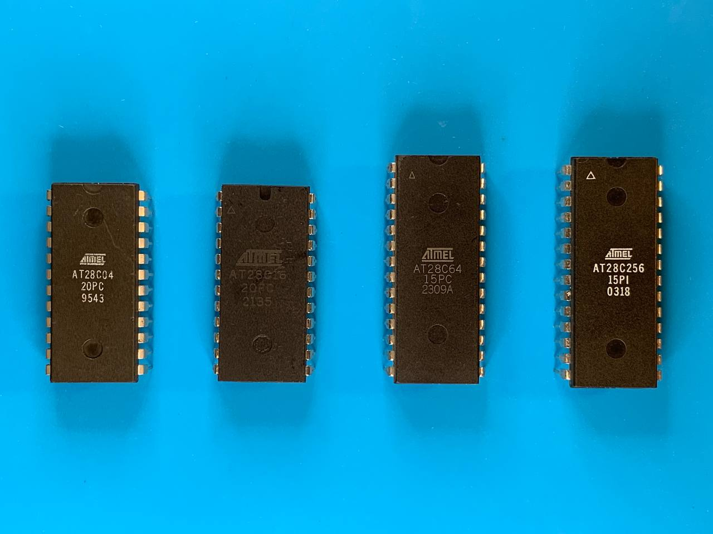

[**EEPROM Programmer** on GitHub](https://github.com/inn-goose/eeprom-programmer)

The EEPROM Programmer project makes it possible to use Arduino platforms with an extended set of pins to read from and write to EEPROM chips from the AT28Cxx family.

The firmware component of the project is flashed onto an Arduino Mega or Due. The EEPROM chip is then connected to the extended pin header on the board, after which the Python CLI can be used to erase, write, or read binary data.

This is a series of posts covering various aspects of the programmer, written in the course of developing this project:

1. [Implementing Initial R/W Interface for AT28C64](/blog/eeprom-programmer-1-initial-implementation/)

2. [Measuring Performance with Oscilloscope](/blog/eeprom-programmer-2-performance/)

3. [Debugging Read Operations](/blog/eeprom-programmer-3-debugging/)

4. [Implementing Serial JSON-RPC API](/blog/eeprom-programmer-4-serial-json-rpc-api/)

5. [Data Corruption on Arduino Serial Connection Reset](/blog/eeprom-programmer-5-data-corruption/)

6. [Using Data Polling vs RDY/!BUSY Pin for Write Operations](/blog/eeprom-programmer-6-data-polling-vs-rdy-busy/)

7. [AT28C256's Page Write Operation](/blog/eeprom-programmer-7-page-write/)

8. [Supported Chips](/blog/eeprom-programmer-8-supported-chips/)

