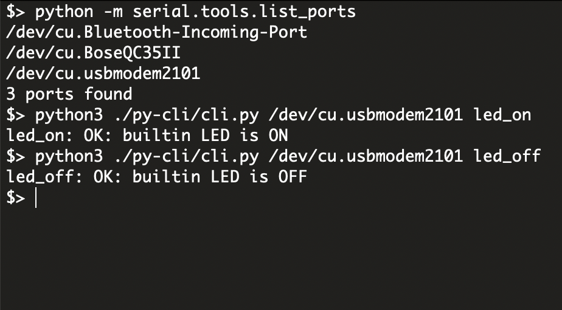


Arduino has one unexpected behavior: when connecting over the Serial interface, the board **resets** and completely loses its internal state. If using the Arduino IDE, this behavior can be observed by simply opening and closing the Serial Monitor. This is not a peculiarity of the Python serial library implementation but rather a built-in characteristic of the Arduino platform itself.



During this reset period, all board pins remain in an **uninitialized** state for about two seconds on an UNO R3. I described the details in the [Misconfigured Arduino Pins](/blog/experiments-2-misconfigured-arduino-pins/#how-arduino-behaves-during-the-reset) post.



## TLDR

While developing the [EEPROM Programmer](https://github.com/inn-goose/eeprom-programmer) project, I encountered a data transfer problem. On one hand, the Arduino IDE's Serial Console is not designed for working with binary data, so it’s necessary to implement a custom `xxd`-like formatter to analyze the read output. On the other hand, designing a protocol to send, for example, 256 KB of binary data over Serial for EEPROM writing is nontrivial.

Existing tools such as `stty` or a simple Python CLI can be used, but they don’t solve the problem of unification. Each time, it’s necessary to define a new protocol format and implement command handlers both on the board and on the CLI side. To address this, I decided to implement the [JSON-RPC](https://www.jsonrpc.org/specification) protocol for Arduino and reuse it in current and future projects. The implementation hides all encoding/decoding and serial-transfer details, allowing the focus to remain on RPC function logic.

I built two libraries: one for the Python CLI and another for Arduino. These libraries are not intended to be distributed via `pip` or "Arduino Library Manager". The [Serial JSON-RPC for Arduino](https://github.com/inn-goose/serial-json-rpc-arduino) project is a ready-to-use template that can be copied directly into any project, integrated as described in the template's [`README.md`](https://github.com/inn-goose/serial-json-rpc-arduino/blob/main/README.md), and immediately provide RPC functionality for "Computer-to-Arduino" Serial communication.


## RAW Serial Protocol Limitations

The main limitation in implementing a serial interface lies in the restricted RAM available on the Arduino board. Because serial communication typically uses `UTF-8` encoding, each 8-bit value requires at least two `HEX` characters, along with optional separators for readability. This design preserves debuggability by keeping transmitted data human-readable, yet the additional formatting introduces significant overhead. While certain optimizations can improve the efficiency of binary transfer, they do not eliminate the underlying constraint.

Transmitting 256 kilobytes of data at once for an EEPROM write is infeasible, as this exceeds the total memory capacity of the Arduino Uno. Large data transfers therefore require segmentation into pages, with each page transmitted as a separate data block. For instance, sending page 8 with a page size of 4 bytes might appear in raw serial form as:

```bash
8 4 FF FF FF FF
```

This representation introduces ambiguity regarding field meaning: which value denotes the page number, which indicates the size, whether separators between bytes are mandatory, whether a continuous stream is acceptable, and how end-of-line signaling should occur. Command intent also remains unclear—whether the operation is a write, read, or compare. Introducing a command identifier resolves this ambiguity, for example:

```bash
WRITE 8 4 FF ...
```

Such a format is practical for a minimal interface with a limited command set but does not scale across projects. Handling of return values, status reporting, and error propagation remains undefined.


## JSON-RPC Protocol Limitations

Adding a `JSON-RPC` interface significantly increases data transfer overhead. First, JSON formatting introduces numerous structural fields and service data. Second, the `ArduinoJson.h` library on the board side requires two to three times the message size in available memory to parse incoming data.

While the raw protocol could theoretically transfer around 2–3 kilobytes per operation, the introduction of JSON-RPC reduces the effective payload to about 350 bytes due to JSON overhead ([_JSON_RPC_BUFFER_SIZE](https://github.com/inn-goose/serial-json-rpc-arduino/blob/b3365d21f906738c7e140b243d2edf54c59c699e/board/serial_json_rpc.h#L29)).

Experiments with various buffer and parser configurations showed that when the buffer size exceeds 500 bytes, the `ArduinoJson` parser returns an empty object. This issue and possible mitigation strategies are described in detail in this doc: ["Why is the output incomplete?"](https://arduinojson.org/v6/issues/incomplete-output/).


## Implementation of JSON-RPC for Arduino

After the full protocol implementation and encapsulation of all related logic into a separate library, working with RPC becomes straightforward and allows focus on the application’s functional code. The [`serial_json_rpc.h`](https://github.com/inn-goose/serial-json-rpc-arduino/blob/main/board/serial_json_rpc.h) library enables registration of a callback in the main sketch module, which receives the command name and the list of call arguments for processing.

The following example demonstrates a ready-to-use interface in a simple application that controls the on-board LED. The full example is here: [`board.ino`](https://github.com/inn-goose/serial-json-rpc-arduino/blob/main/board/board.ino)

```cpp
#import "serial_json_rpc.h"
using namespace SerialJsonRpcLibrary;

static SerialJsonRpcBoard rpc_board(rpc_processor);

void rpc_processor(int request_id, const String &method, const String params[], int params_size) {
    if (method == "set_builtin_led") {
        int status = atoi(params[0].c_str());
        digitalWrite(LED_BUILTIN, status ? HIGH : LOW);
        rpc_board.send_result_string(request_id, status ? "OK: builtin LED is ON" : "OK: builtin LED is OFF");
    }
}

void loop() {
  rpc_board.loop();
}
```

This interface supports handling the following commands through the Arduino IDE Serial Monitor:

```json
{"jsonrpc":"2.0","id":0,"method": "set_builtin_led", "params": [1]}

{"jsonrpc":"2.0","id":0,"method": "set_builtin_led", "params": [0]}
```


## Implementation of JSON-RPC for CLI

The primary objective, however, was to provide a Python CLI implementation, enabling control of the Arduino directly from the console.

Here is the simiple setup which is required to implement such a [`CLI`](https://github.com/inn-goose/serial-json-rpc-arduino/blob/main/py-cli/cli.py):

```python
from serial_json_rpc import client

json_rpc_client = client.SerialJsonRpcClient(...)

json_rpc_client.init()

json_rpc_client.send_request("set_builtin_led", [0])
```

The same commands can be executed through the CLI as shown below. Environment setup and library configuration details are provided in the project [`README`](https://github.com/inn-goose/serial-json-rpc-arduino/tree/main).

```bash
python3 ./py-cli/cli.py /dev/cu.usbmodem2101 led_on

python3 ./py-cli/cli.py /dev/cu.usbmodem2101 led_off
```



Adding an RPC layer between the computer and Arduino simplifies control and data transfer, allowing both applications to focus on business logic. This approach streamlines development and improves debugging efficiency.


## Next Steps

* Write a post describing the JSON-RPC protocol implementation for the [EEPROM Programmer](https://github.com/inn-goose/eeprom-programmer) project, including detailed protocol structure and usage examples;

* Investigate how Arduino’s automatic reset on Serial connection can affect data integrity of an attached EEPROM chip, considering the latest [Arduino Reset](/blog/experiments-2-misconfigured-arduino-pins/#how-arduino-behaves-during-the-reset) findings.
