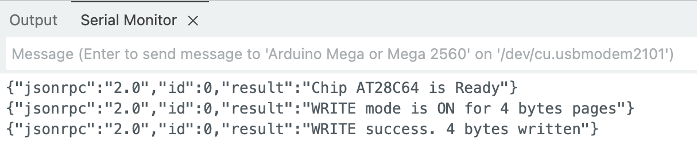
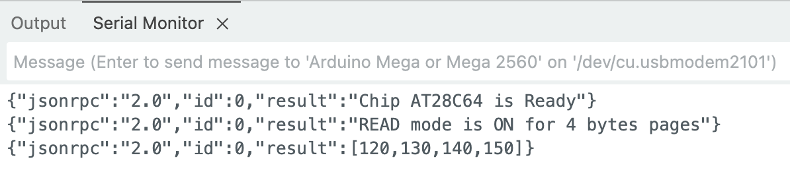

## TLDR

🚧 WIP 🚧


## RAW Serial Protocol Limitations

🚧 WIP 🚧

* serial connection resets the board
* limited controller memory
* overcomplicated non-RPC implementation
* non-scalable interface, requires manual formatting


## JSON-RPC Interface

🚧 WIP 🚧

https://www.jsonrpc.org/specification


## Board Implementation

🚧 WIP 🚧

### JSON-RPC API

`init_chip(chip_type: str)`

```json
{"jsonrpc":"2.0", "id":0, "method": "init_chip", "params": ["AT28C64"]}
```

`set_read_mode(page_size_bytes: int)`

```json
{"jsonrpc":"2.0", "id":0, "method": "set_read_mode", "params": [4]}
```

`read_page(page_no: int)`

```json
{"jsonrpc":"2.0", "id":0, "method": "read_page", "params": [0]}
```

`set_write_mode(page_size_bytes: int)`

```json
{"jsonrpc":"2.0", "id":0, "method": "set_write_mode", "params": [4]}
```

`write_page(page_no: int, data: array[int])`

```json
{"jsonrpc":"2.0", "id":0, "method": "write_page","params": [0, [120, 130, 140, 150]]}
```

### Write Operation

To write first 4 bits, send these commands one by one using Arduino IDE's *Serial Monitor* on `115200` baud.

```json
{"jsonrpc":"2.0", "id":0, "method": "init_chip", "params": ["AT28C64"]}
{"jsonrpc":"2.0", "id":0, "method": "set_write_mode", "params": [4]}
{"jsonrpc":"2.0", "id":0, "method": "write_page","params": [0, [120, 130, 140, 150]]}
```



### Read Operation

To read first 4 bits, send these commands one by one using Arduino IDE's *Serial Monitor* on `115200` baud.

```json
{"jsonrpc":"2.0", "id":0, "method": "init_chip", "params": ["AT28C64"]}
{"jsonrpc":"2.0", "id":0, "method": "set_read_mode", "params": [4]}
{"jsonrpc":"2.0", "id":0, "method": "read_page", "params": [0]}
```




## CLI Usage

🚧 WIP 🚧

Check the [`eeprom-api-arduino`](https://github.com/inn-goose/eeprom-api-arduino) for the python `venv` init and the `zenith_zt1_eeprom.bin` source.

### Read Operation

```bash
mkdir ./tmp

PYTHONPATH=./eeprom_api_py_cli/:$PYTHONPATH python3 ./eeprom_api_py_cli/cli.py /dev/cu.usbmodem2101 -p AT28C64 --read tmp/dump_eeprom_api.bin

xxd tmp/dump_eeprom_api.bin
```

```
00000000: ffff ffff ffff ffff ffff ffff ffff ffff  ................
00000010: ffff ffff ffff ffff ffff ffff ffff ffff  ................
00000020: ffff ffff ffff ffff ffff ffff ffff ffff  ................
...
00001fe0: ffff ffff ffff ffff ffff ffff ffff ffff  ................
00001ff0: ffff ffff ffff ffff ffff ffff ffff ffff  ................
```

### Write Operation

```bash
PYTHONPATH=./eeprom_api_py_cli/:$PYTHONPATH python3 ./eeprom_api_py_cli/cli.py /dev/cu.usbmodem2101 -p AT28C64 --write tmp/zenith_zt1_eeprom.bin
```

result `xxd` after read:
```
00000000: 01c9 0130 af02 0129 d289 3230 af02 017b  ...0...)..20...{
...
00000f70: 0ff0 d0e0 2241 6e73 7765 7220 566f 6963  ...."Answer Voic
00000f80: 6520 6361 6c6c 2c20 7072 6573 7320 5245  e call, press RE
00000f90: 5455 524e 2000 5072 6573 7320 4845 4c50  TURN .Press HELP
00000fa0: 0050 7265 7373 2051 5549 5420 746f 2065  .Press QUIT to e
00000fb0: 7869 7400 904f 4e20 4c49 4e45 8020 0080  xit..ON LINE. ..
00000fc0: 4f46 4620 4c49 4e45 8000 9244 4941 4c49  OFF LINE...DIALI
00000fd0: 4e47 8020 0090 5741 4954 0090 5072 696e  NG. ..WAIT..Prin
00000fe0: 7465 7280 0080 2020 2020 2020 2080 2000  ter...       . .
...
00001ff0: ffff ffff ffff ffff ffff ffff ffff ffff  ................
```

### Erase Operation

```bash
PYTHONPATH=./eeprom_api_py_cli/:$PYTHONPATH python3 ./eeprom_api_py_cli/cli.py /dev/cu.usbmodem2101 -p AT28C64 --erase cc
```

result `xxd` after read:
```
00000000: cccc cccc cccc cccc cccc cccc cccc cccc  ................
00000010: cccc cccc cccc cccc cccc cccc cccc cccc  ................
00000020: cccc cccc cccc cccc cccc cccc cccc cccc  ................
...
00001fe0: cccc cccc cccc cccc cccc cccc cccc cccc  ................
00001ff0: cccc cccc cccc cccc cccc cccc cccc cccc  ................
```


## EEPROM API vs XGecu Programmator

🚧 WIP 🚧

```bash
```


## Next Steps

🚧 WIP 🚧

* arduino pins metastable state
* arduino resets and data corruption