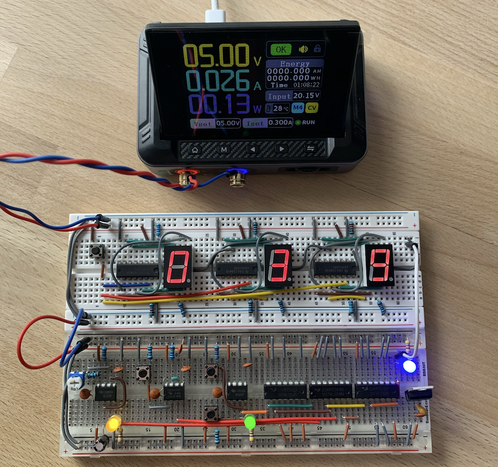
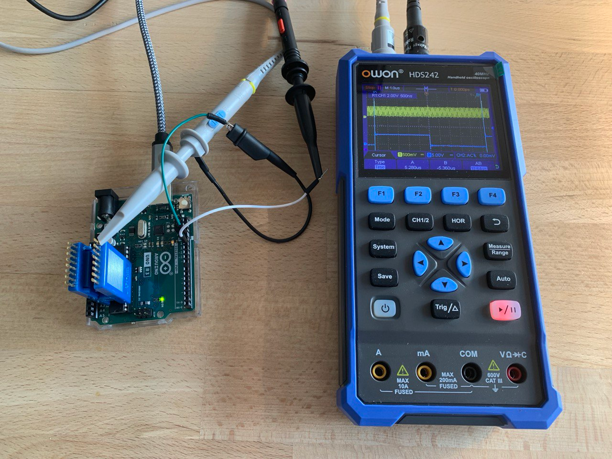
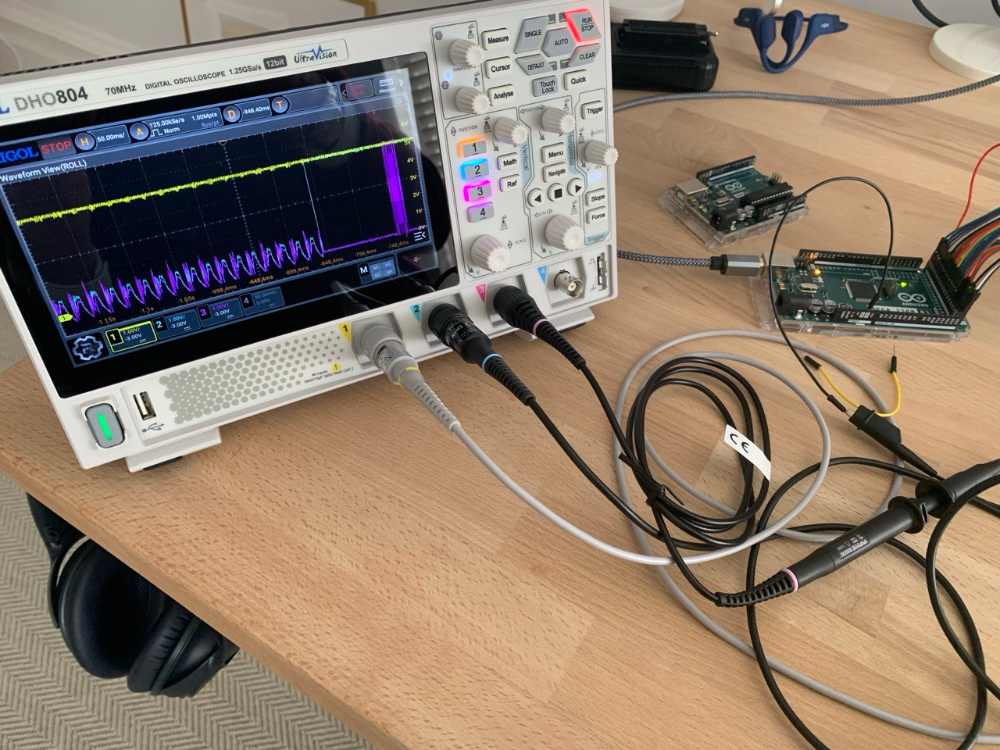
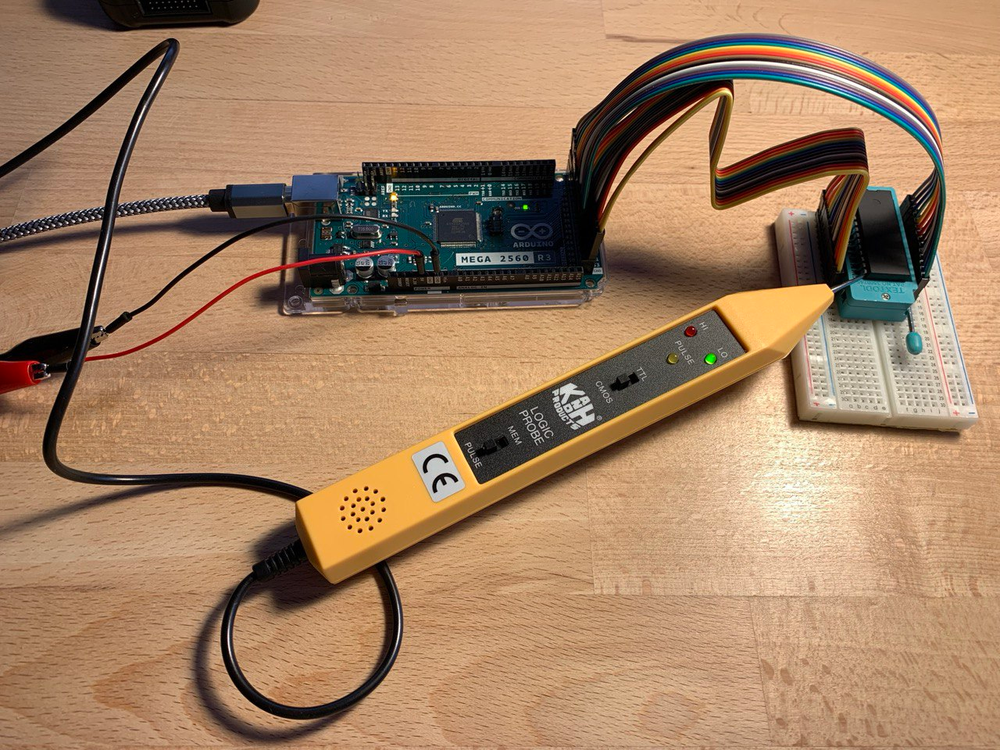

---
###
title: Tools
###
showDate: false
showWordCount: false
showReadingTime: false
showZenMode: false
###
showLikes: false
showViews: false
###
showAuthor: true
showAuthorBottom: true
---

## Fnirsi DPS-150 Adjustable DC Power Supply

An essential tool for checking the forward voltage of a diode or transistor, limiting current in a circuit, or measuring the power consumption of a breadboard computer. After using this device, all battery-based or plug-in power supply solutions start to feel like a thing of the past.

## Fnirsi DSO-152 1CH Ocsilloscope

This oscilloscope is a solid entry-level option. It allows observation of capacitor discharge, contact bounce, and Arduino PWM behavior. One channel is sufficient for most basic electronics experiments involving capacitors, LEDs, and relays. But becomes limiting when analyzing circuits such as transistor pulse generators or 555 timers.

## OWON HDS-242 2CH Ocsilloscope

This oscilloscope is a real find. It takes up almost no space, has two channels—finally allowing observation of the 555 timer and capacitor behavior as a whole—and provides enough bandwidth to measure PWM on an Arduino Giga. It includes all the essential functions for exploring the world of integrated circuits, such as frequency and amplitude measurement. Its limitations became noticeable only when debugging EEPROM IC behavior, which involves three management pins along with separate address and data buses.

## Rigol DHO-804 4CH Ocsilloscope

For my level of research, this is a highly professional apparatus. It has countless controls and offers far more functionality than I will likely ever need. With its help, I was finally able to locate the issue in my EEPROM Programmer using three probes simultaneously. If a full laboratory setup were available, this would probably be the only oscilloscope in use. For now, however, the OWON is still used for simpler tasks—it starts up faster and provides the same essential functionality.

## K&H LP-2800 Logic Probe

A surprisingly capable device that shows exactly what’s happening at the digital signal level. It clearly distinguishes HIGH, LOW, and data flow states. The only thing it’s missing is an audible signal. There’s enough room in the case for it, and I’ve already built a small 555-timer buzzer—just haven’t attached it yet.

